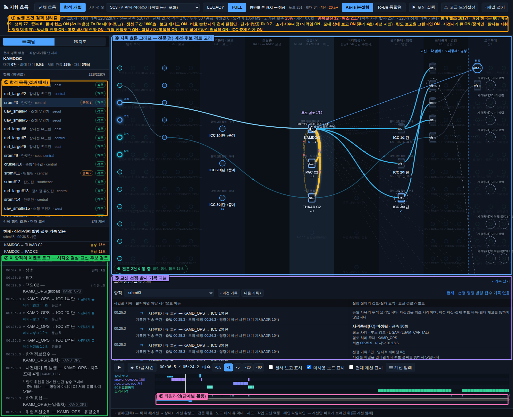
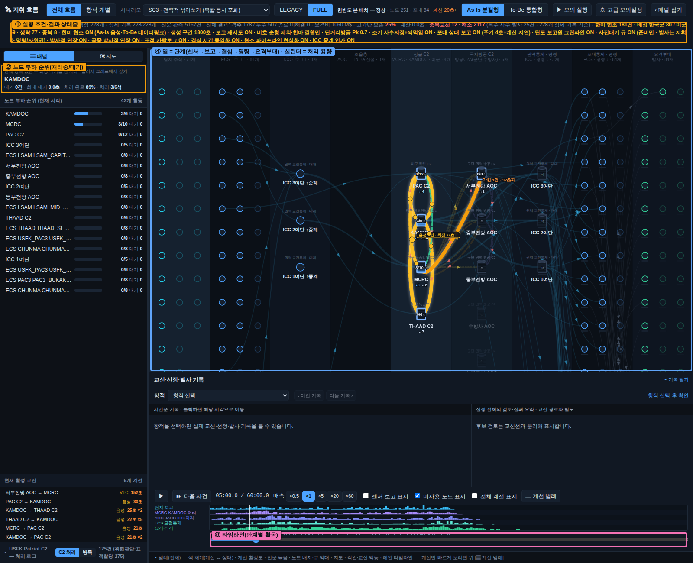
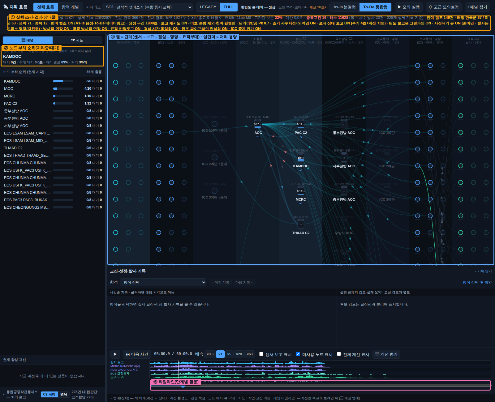
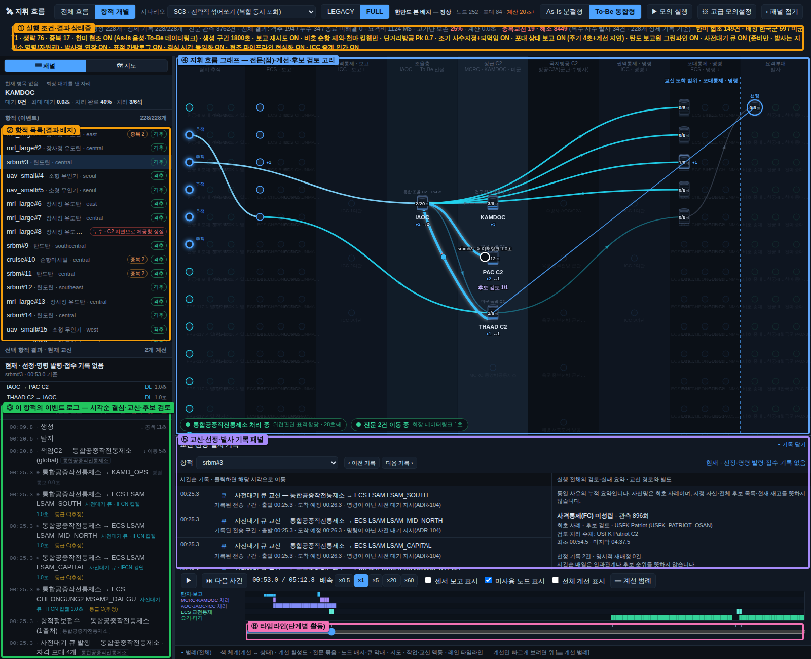
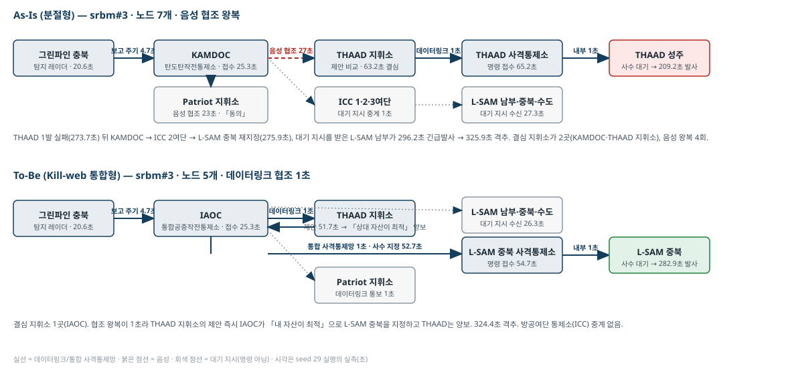
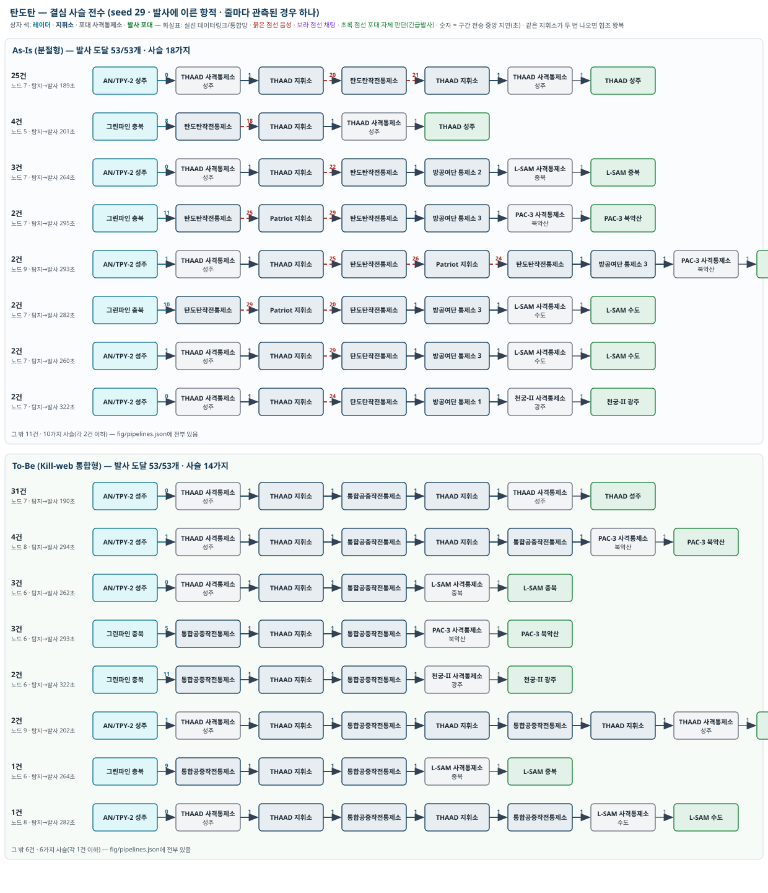
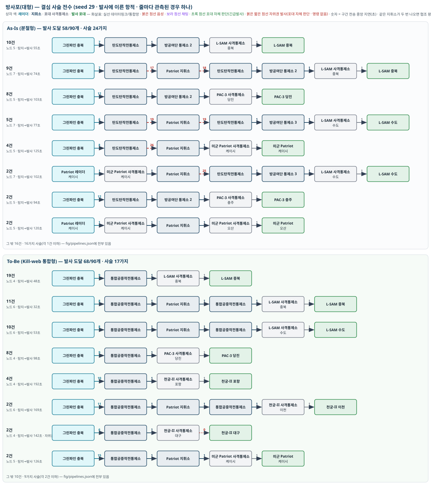
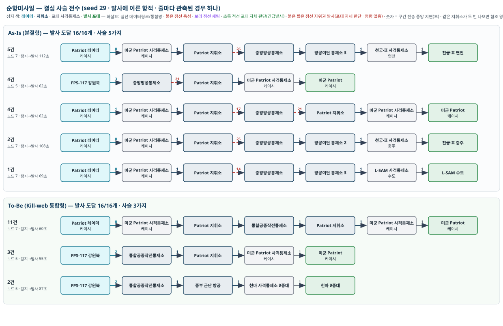
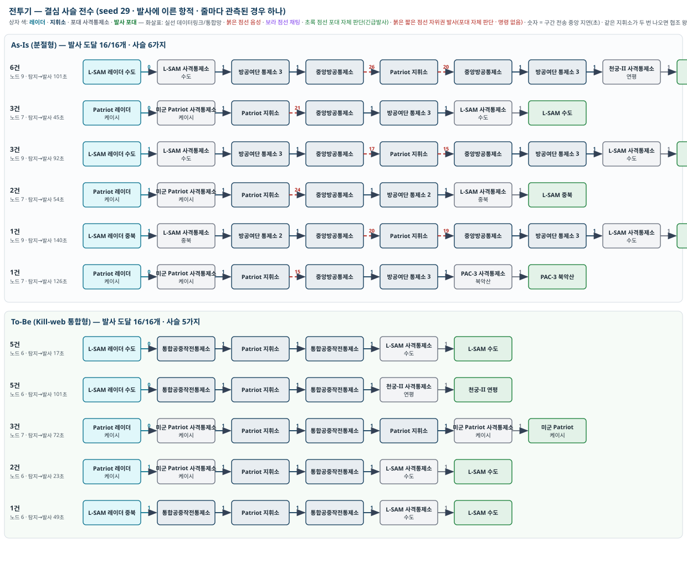
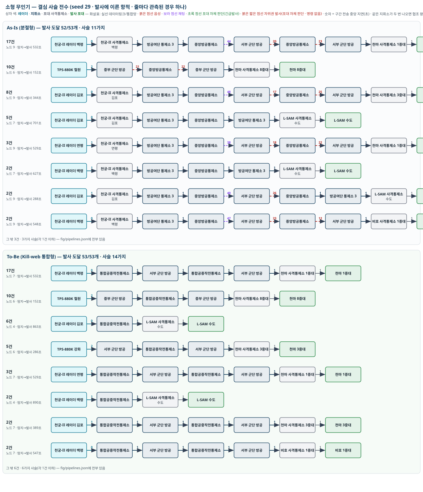

# 효과척도 분석 결과서 — 복합 동시 포화(SC3) · 한반도 본 배치 · As-Is 대 To-Be(Kill-web) (2026-10-04 개정 6판)

> 이 문서의 모든 수치는 공개자료 기반의 **정책연구용 개념값**이며 실제 작전자료가 아닙니다. 결과는 6장에 적은 가정을 전제로만 읽어야 합니다.
> 용어: **As-Is** = 현 체계, **To-Be** = Kill-web(킬웹) 체계.
> 실행 조건: SC3 복합 동시 포화 · 한반도 본 배치(지휘소 96 · 포대 84) · 강도 1배 · **위협 생성 1800초 · 관측 3600초** · seed 29(주 결과)와 30·31(재현성) · [지휘 흐름] 화면 기본 설정(**포대 상태 보고** 포함 — 결심 지휘소는 포대가 4초마다 올린 보고가 계선 지연만큼 늦게 닿은 상태로 후보를 가림 · 6장 13항 — **대기 지시는 준비 지시만**이어서 포대는 지휘소의 사수 지정 명령이 있어야 쏘고, 명령 없이 쏘는 길은 자위권 발사뿐 · 6장 14항 — 그리고 **공중 위협도 탄도와 같이 발사·이륙 원점에서 생성**(6판 · 6장 15항)). 생성 위협 228개(탄도탄 53 · 방사포 90 · 순항미사일 16 · 전투기 16 · 소형 무인기 53). 용어: **누수** = 요격 실패로 표적에 도달한 위협. 관측을 생성 구간보다 길게 두어 모든 위협이 격추 또는 누수로 끝났으므로(마지막 항적 종료 2310초) **미해결(관측 절단) 항적은 0**입니다. 지휘소 이용률(5장·7장)은 위협이 들어오는 생성 구간 1800초 기준입니다.
> 개정 6판(2026-10-04): 「생성」의 기준을 통일했습니다. 5판까지 탄도 위협은 발사 시각에, 공중 위협(순항·전투기·무인기)은 감시 공역 진입 시각에 생성돼 3장의 「생성→탐지」가 두 부류에서 다른 것을 재고 있었습니다(사용자 지적). 이제 공중 위협도 발사·이륙 원점(무인기 10 · 전투기 80 · 순항 100 km 뒤)에서 생성합니다. 그 결과 공중 위협은 발사 직후부터 보이게 되어 결심이 앞당겨지고 사수 대기가 길어졌으며, 순항미사일의 사수가 천마에서 미군 Patriot으로 바뀌는 등 공중 위협의 수치가 달라졌습니다(6장 15항). 전 수치를 이 조건으로 다시 산출했습니다. 결심 규칙(3판)·포대 상태 보고(4판)·표준 절차(5판)는 그대로입니다.
> 개정 5판(2026-10-03): 대기 지시(큐)를 받은 포대가 조건이 갖춰지면 명령 없이 쏘던 「긴급발사」를 없애고, 지휘소가 사수를 지정해 명령하고 포대가 요격한 뒤 결과를 보고하는 표준 절차로 고쳤습니다. 포대가 스스로 쏘는 길은 자위권 발사(③)만 남겼습니다.

## 한눈에 보기

| 결론 | 자세히 |
|---|---|
| **격추 수에서 To-Be가 앞섭니다**(228개 중 178 대 192, seed 3개 평균 185 대 198 — 차이 +14·+14·+13으로 세 seed 모두 같은 방향). 4판까지 비슷하던 두 체계가 갈라진 것은, 대기 지시를 받은 포대의 긴급발사를 없애고 **지휘소 명령으로만 쏘게 하자(표준 절차)** 명령 경로의 차이가 그대로 격추 수로 드러났기 때문입니다(6장 14항). 교전 시작까지 평균 222 → 215초(seed 3개 모두 To-Be가 짧음 · 229 → 218, 232 → 225), 격추까지 263 → 252초 | 3장 · 6장 |
| **결심은 지휘소가 항적을 받은 직후에 납니다.** 탐지 레이더 보고를 받은 결심 지휘소가 예상 요격 창과 포대 상황을 보고 사수를 미리 정합니다. 탄도탄의 「지휘소 접수 → 결심」은 As-Is 58초, To-Be 20초(한미 협조가 데이터링크). 대신 「결심 → 발사」에 **사수 대기**(포대가 쏠 수 있게 되기까지)가 들어가 탄도탄은 167~203초입니다. 발사·명중 시각은 두 체계가 같습니다 — 쏠 수 있는 물리 시점은 지휘 구조가 바꾸지 못합니다 | 1-0 · 3장 |
| **예측이 빗나가면 포대가 「수행 불가」를 회신하고 지휘소가 바로 재지정합니다.** 되먹임이 없던 판(3판 이전 조건)에서는 잘못 정한 사수가 요격 창이 닫힐 때까지 기다려 To-Be 격추가 209까지 줄었고, 되먹임을 넣자 215로 회복됐습니다. 지휘소가 몇 초 전 포대 상태로 판단하므로 되먹임이 그 오차까지 받습니다(수행 불가 회신 As-Is 70건 · To-Be 37건). 포대가 명령 없이 쏘는 길은 **자위권 발사(③)** 하나이며 화면에 따로 표시됩니다(결심 10·11건 중 실제 발사 1·2건) | 1-0 · 6장 |
| **거치는 노드 수는 To-Be에서 줄어듭니다.** 소형 무인기 6~9 → 4~6, 전투기 7~9 → 6~7, 방사포 5~7 → 4~7. 탄도탄은 5~9 → 6~9, 순항미사일은 5~7 → 5~7로 같습니다(THAAD·Patriot 지휘소와의 협조 왕복이 두 체계에 다 남음). 같은 위협에서 폭이 생기는 것은 어느 레이더가 먼저 보았는지, 한미 협조가 몇 번 붙었는지, 사수가 어느 소속인지 때문입니다(4-1) | 4장 |
| **To-Be의 통합 지휘소에 병목은 생기지 않았습니다.** 통합공중작전통제소 이용률 20%, 대기 0초. 병목은 **포대**에 있습니다. 84개 포대 중 55~59개는 한 발도 쏘지 않았고, 상위 3개 포대가 발사의 41~45%를 맡았으며 THAAD 성주가 39·38발, 수도 L-SAM은 보유탄 24발을 다 쓰고 재장전분까지 33·39발을 썼습니다. 이 편중은 발사 간격·채널·보유탄 안에서 모델이 허용한 결과이지만, 15분 재장전·무한 재보급·1표적 1발 가정이 처리량을 넉넉하게 봅니다 | 5장 |
| **THAAD가 탄도탄을 가장 많이 쏘는 이유**는 우선권이 아니라 요격 가능 구간이 먼저 열리기 때문입니다(탄도탄 46·45개 격추 중 THAAD 39·38발). **미군 자산을 빼면** 탄도탄 격추 46 → 27(As-Is)·45 → 25(To-Be), 결심 58 → 89초·20 → 57초. 미군이 없어도 To-Be의 우위는 유지됩니다(154 대 165) | 1장·5-4 |
| **한미 중복 발사는 As-Is 8건 · To-Be 12건입니다.** As-Is의 중복은 음성 협조 전문이 엇갈려 탄도탄작전통제소와 THAAD 지휘소가 같은 탄도탄에 각자 사수를 지정한 것(9장 srbm#3 — 이 예에서는 중복이 오히려 격추를 만듦)이고, To-Be의 중복은 군단 방공이 협조 고리 밖에 있어 생기는 것입니다. 둘 다 모델 구조의 빈틈이며 6장에 적었습니다 | 5-2 · 6장 · 9장 |
| **차이가 격추 수로 드러나는 자리와 그렇지 않은 자리.** 요격 창(물리)과 포대 자원이 정하는 부분(탄도탄의 THAAD 몫, 소형 무인기의 천마 사거리 대기)은 두 체계가 같습니다. 지휘소 명령이 요격 창 안에 닿아야 하는 부분(방사포 51 대 64)에서 To-Be의 짧은 사슬과 데이터링크 협조가 격추 수로 드러납니다 | 2장 |

## 1. 위협별로 거치는 지휘 노드 — 대표 경로

위협이 탐지된 뒤 발사에 이르기까지 정보와 명령이 지나가는 노드를 위협 종류별로 정리했습니다. 실제 실행에서 나온 경로를 **나올 수 있는 경우의 수**로 묶은 것이며, 화살표 하나가 노드 하나를 건너는 것입니다.

용어. **탄도탄작전통제소**(As-Is의 탄도탄 결심 지휘소), **중앙방공통제소**(As-Is의 공중 위협 결심 지휘소), **통합공중작전통제소**(To-Be에서 둘을 합친 결심 지휘소), **방공여단 통제소**(As-Is에서 탄도탄작전통제소·중앙방공통제소와 포대 사이의 중계), **군단 방공 지휘소**(저고도 위협을 맡는 육군 지휘소), **포대 사격통제소**(포대의 명령 접수·발사 통제), **미군 THAAD 지휘소·Patriot 지휘소**(미군 자산만 지휘). **⇄ 협조**는 결심 지휘소가 상대 진영 지휘소에 「내 최적 사수」를 제안하고 회신을 받는 왕복입니다(As-Is 음성 · To-Be 데이터링크).

### 1-0. 결심은 어떻게 이루어지나 — 탐지 레이더, 사수 지정, 포대 레이더, 발사의 관계

이 모델의 요격 절차는 다음 다섯 단계입니다. 핵심은 **「결심 지휘소가 항적을 받은 시점에 사수를 정해 명령하고, 명령받은 포대가 준비되는 순간 쏜 뒤 결과를 보고한다」**는 점이며, 포대가 명령 없이 쏘는 길은 자위권 발사(③) 하나뿐입니다.

1. **탐지와 인지.** 탐지 레이더(그린파인·FPS-117·TPS-880K)가 위협을 잡아 책임 지휘소에 보고합니다. 탄도탄·방사포는 그린파인 보고로 탄도탄작전통제소(To-Be는 통합공중작전통제소)가 알고, 공중 위협은 FPS-117·TPS-880K 보고로 중앙방공통제소·군단 방공이 압니다. 탐지 레이더는 감시 등급 항적만 주며, 이것만으로 포대가 발사할 수는 없습니다.
2. **대기 지시(큐잉).** 탄도탄·방사포에 한해, 결심 지휘소는 알아챈 즉시 요격 가능한 상층 포대 전부에 「미리 준비하라」는 대기 지시를 내립니다. 이 지시는 표적 정보를 미리 주어 포대 레이더가 추적을 시작하게 하는 **준비 지시**이지 발사 권한이 아닙니다. 대기 지시를 받은 포대도 3단계의 사수 지정 명령이 있어야 쏩니다(5판 — 4판까지는 이 지시가 발사 권한을 겸해 포대가 조건이 갖춰지면 명령 없이 쏘는 「긴급발사」가 방사포의 5분의 4였습니다 · 6장 14항).
3. **사수 지정(결심).** 결심 지휘소는 항적을 받은 직후, 자기 아래 포대 하나하나에 대해 **「지금 쏠 수 있는가」 뿐 아니라 「언제 쏠 수 있게 되는가」를 예측**합니다. 이때 쓰는 포대 상태(잔탄·교전 채널·레이더 사격통제 등급)는 포대가 4초마다 올린 보고가 계선 지연만큼 늦게 닿은 것이라 몇 초 전 상태이고, 요격점 계산만 지휘소 자체 계산이라 지연이 없습니다(6장 13항). 예측은 실제 발사 평가와 같은 조건(앞으로 300초 안에 요격탄이 제때 닿는 요격점이 있는가, 포대 레이더가 사격통제 거리에 들어와 사격통제 등급이 되는가)으로 계산하며, 어느 쪽도 성립하지 않는 포대는 후보가 아닙니다. 지금 쏠 수 있는 포대와 곧 쏠 수 있게 될 포대를 한 후보군에 놓고 점수(요격 확률·잔탄·동시교전 채널·부하·거리에, 준비까지 남은 시간이 길수록 깎는 감쇠를 곱한 것)로 사수 하나를 고릅니다. 미군과는 이 시점에 협조(As-Is 음성 · To-Be 데이터링크)로 「누가 쏠지」를 맞춥니다. 명령은 「준비되면 쏘라」는 뜻으로 포대 사격통제소를 거쳐 포대에 닿습니다. 탄 소진·채널 포화·교전 불가 유형은 예측하지 않고 바로 제외합니다.
4. **포대 레이더의 사격통제 등급과 발사, 그리고 결과 보고.** 사수로 지정된 포대는 자기 사격통제 레이더로 위협을 잡아 탐지 → 추적 → 사격통제 등급으로 올립니다. 레이더가 사격통제 등급에 이르고 요격점이 사거리·고도 안에 들어오는 순간 쏩니다. 그때까지는 **사수 대기** 상태로, 같은 축의 재결심은 막힙니다. 발사 뒤 명중·빗나감은 교전 결과 보고(BDA)로 지휘소에 올라가고, 빗나가면 지휘소가 재지정합니다. **자위권 발사(③).** 사수 지정이 없는 포대라도, 위협이 자기 방어 구역으로 들어와 발사 마감이 닥치면 「내가 맞을 것 같다」는 자체 판단으로 쏠 수 있습니다. 이 결심은 명령이 아니라 포대 자체 판단이며, 화면에서 붉은 짧은 점선 고리와 「자위권 ③」 표식으로 구분됩니다. seed 29에서 자위권 결심은 As-Is 10건·To-Be 11건이었고 그중 실제 발사에 이른 것은 1·2건, 나머지는 발사 직전 재검증(사격통제 미성립·요격점 없음)에서 「발사 불가」로 끝났습니다.
5. **수행 불가 회신과 재지정.** 미리 정한 사수가 예측 준비 시각 + 30초가 지나도 준비되지 못하면(레이더가 사격통제 등급에 이르지 못함, 요격점이 안 잡힘) 포대가 「수행 불가(CANTCO)」를 회신하고, 지휘소는 1초 뒤 다른 사수를 정합니다. 회신한 포대는 60초 동안 예측 재지정에서 빠지고, 군단 방공 같은 다른 웹은 공유 현황에서 계획이 사라진 것을 보고 자기 결심을 진행합니다. 실제 방공 절차의 WILCO/CANTCO 되먹임을 옮긴 것입니다. seed 29에서 As-Is 70건·To-Be 37건의 회신이 있었고, 창이 닫힐 때까지 기다린 지정은 1·1건입니다.

이 구조 때문에 3장의 「지휘소 접수 → 결심」은 지휘소가 사수를 고르는 데 걸린 시간(예측 가능한 후보가 생길 때까지의 짧은 보류 포함)이고, 「결심 → 발사」가 **포대가 쏠 수 있게 되기까지의 대기**를 담습니다. 탄도탄은 THAAD가 고도 150 km 아래로 들어오는 시점까지, 소형 무인기는 천마 사거리 9 km에 들어올 때까지 기다립니다. 지휘 구조와 결심 규칙이 바뀌어도 이 대기는 바뀌지 않습니다.

### 탄도탄

| 경우 | As-Is | To-Be |
|---|---|---|
| ① 미군 THAAD가 쏘는 경우(가장 흔함) | AN/TPY-2 레이더 → THAAD 사격통제소 → **THAAD 지휘소** ⇄ 음성 협조 **탄도탄작전통제소** → THAAD 사격통제소 → THAAD 발사 | AN/TPY-2 → THAAD 사격통제소 → THAAD 지휘소 ⇄ 데이터링크 협조 **통합공중작전통제소** → THAAD 사격통제소 → THAAD 발사 |
| ② 협조 결과 한국군이 쏘는 경우 | 위와 같되 탄도탄작전통제소가 「내 자산이 최적」으로 회신 → 방공여단 통제소 → PAC-3·L-SAM 사격통제소 → 발사 | 통합공중작전통제소가 「내 자산이 최적」으로 회신 → PAC-3·L-SAM 사격통제소 → 발사 |
| ③ 자위권 발사(협조 없이 발사) | 요격 창이 45초 미만으로 촉박하면 협조를 생략하고 THAAD 지휘소 → THAAD 사격통제소 → 발사 | 같음(데이터링크라 드묾) |
| ④ 한국군이 먼저 제안하고 THAAD가 「내 자산이 최적」으로 회신하는 경우 | 그린파인 → **탄도탄작전통제소** ⇄ 음성 협조 THAAD 지휘소 → THAAD 사격통제소 → THAAD 발사 | 그린파인 → **통합공중작전통제소** ⇄ 데이터링크 협조 THAAD 지휘소 → THAAD 사격통제소 → 발사 |
| ⑤ 대기 지시(준비)를 받은 한국군 상층 포대가 정식 명령으로 쏘는 경우 | 그린파인 → 탄도탄작전통제소 →(대기 지시 · 준비만) 방공여단 통제소 → L-SAM 사격통제소 … 이어서 탄도탄작전통제소의 사수 지정 명령 → 방공여단 통제소 → L-SAM 사격통제소 → 발사 | 그린파인 → 통합공중작전통제소 →(대기 지시 · 준비만) L-SAM 사격통제소 … 이어서 통합공중작전통제소의 사수 지정 명령 → L-SAM 사격통제소 → 발사 |
| ⑥ 자위권 발사(포대 자체 판단 · 명령 없음) | 사수 지정이 없는 포대가 발사 마감이 닥친 위협에 스스로 쏨 — 탄도탄에서는 거의 없음 | 같음 |

**왜 THAAD가 가장 많이 쏘는가.** 「미군이 먼저 쏜다」는 규칙은 모델에 없습니다. THAAD 지휘소와 탄도탄작전통제소는 각자 자기 포대만 놓고 독립적으로 결심하고, 협조는 양쪽 후보의 점수를 비교할 뿐입니다. THAAD가 대부분을 맡는 이유는 **요격 가능 구간이 먼저 열리기 때문**입니다. THAAD는 고도 40~150 km·거리 200 km까지 쏠 수 있어 탄도탄이 정점을 지나 내려오기 시작하면 바로 후보가 되지만, L-SAM은 고도 40~60 km의 좁은 띠에서만 쏠 수 있어 하강 마지막 단계(발사 뒤 260초 무렵)에야 후보가 됩니다. 양쪽이 항적을 받은 직후에 예상 요격 창으로 점수를 비교하는데, 준비까지 남은 시간이 길수록 점수를 깎으므로 창이 먼저 열리는 THAAD가 뽑힙니다(9장의 srbm#3이 그 예: 탄도탄작전통제소가 중북 L-SAM을 제안했지만 THAAD 지휘소가 「내 자산이 최적」으로 회신). 확인 실험: THAAD와 그 레이더를 빼면 탄도탄 격추가 46 → 29개(As-Is)·45 → 31개(To-Be)로 줄고, 결심까지 평균 58초 → 109초·20 → 59초로 늦어지며, 수도 L-SAM(12·13발)·PAC-3 북악산(7·10발)·미군 Patriot 군산(10·8발)이 그 몫을 나눠 맡습니다(5-4절).

### 방사포(대형)

| 경우 | As-Is | To-Be |
|---|---|---|
| ① 정식 명령 | 그린파인 → **탄도탄작전통제소** ⇄ 음성 협조 Patriot 지휘소 → 방공여단 통제소 → L-SAM 사격통제소 → L-SAM 발사 | 그린파인 → **통합공중작전통제소** ⇄ 데이터링크 협조 Patriot 지휘소 → L-SAM 사격통제소 → L-SAM 발사 |
| ② 협조 없이 바로 명령 | 그린파인 → 탄도탄작전통제소 → 방공여단 통제소 → PAC-3 사격통제소 → 발사 | 그린파인 → 통합공중작전통제소 → L-SAM·PAC-3 사격통제소 → 발사 |
| ③ 대기 지시(준비) 뒤 정식 명령(실제로는 이 경로가 대부분) | 그린파인 → 탄도탄작전통제소 →(대기 지시 · 준비만) 방공여단 통제소 → 포대 사격통제소 … 이어서 사수 지정 명령 → 방공여단 통제소 → 포대 사격통제소 → 발사 | 그린파인 → 통합공중작전통제소 →(대기 지시 · 준비만) 포대 사격통제소 … 이어서 사수 지정 명령 → 포대 사격통제소 → 발사 |
| ⑤ 자위권 발사(포대 자체 판단) | 명령을 못 받은 포대가 발사 마감에 스스로 쏨 — 방사포에서 As-Is 1건·To-Be 2건 | 같음 |
| ④ 미군 축 자체 처리 | Patriot 레이더 → Patriot 사격통제소 → Patriot 지휘소 → Patriot 사격통제소 → 발사 | 같음 |

방사포 90개 중 발사에 이른 58·68개는 모두 ①~④의 사수 지정 명령으로 쏘았고(자위권 발사 1·2건 제외), 나머지 32·22개는 명령이 요격 창 안에 닿지 못하거나(지휘 시한·교전 시한 초과) 탄 소진에 걸려 발사에 이르지 못했습니다. 4판(긴급발사 허용)에서 72~75개가 포대 자체 발사였던 자리입니다.

### 순항미사일

| 경우 | As-Is | To-Be |
|---|---|---|
| ① 미군 Patriot 케이시가 쏘는 경우(가장 흔함 · 8·14건) | Patriot 레이더 → Patriot 사격통제소 → Patriot 지휘소 ⇄ 음성 협조 **중앙방공통제소** → Patriot 사격통제소 → 발사 · 또는 FPS-117 → 중앙방공통제소 →(음성 제안) Patriot 지휘소 → Patriot 사격통제소 → 발사 | Patriot 레이더 → Patriot 사격통제소 → Patriot 지휘소 ⇄ 데이터링크 협조 **통합공중작전통제소** → Patriot 사격통제소 → 발사 · 또는 FPS-117 → 통합공중작전통제소 → Patriot 지휘소 → Patriot 사격통제소 → 발사 |
| ② 한국군 천궁-II가 쏘는 경우(As-Is 7건) | Patriot 레이더 → Patriot 사격통제소 → Patriot 지휘소 →(음성 제안) 중앙방공통제소 → 방공여단 통제소 → 천궁-II 연천·충주 사격통제소 → 발사 | 거의 없음 — 데이터링크 협조에서 Patriot 케이시가 먼저 뽑힘 |
| ③ 천마가 근거리에서 쏘는 경우(To-Be만 · 2건) | 해당 없음 — As-Is에서는 군단 방공에 순항 항적이 내려오지 않음 | FPS-117 → 통합공중작전통제소 → **군단 방공 지휘소** → 천마 사격통제소 → 천마 발사 |

비호는 순항미사일 교전 대상이 아닙니다. 천마는 근거리 순항 요격이 가능하지만, As-Is에서는 비호와 같은 군단 방공 지휘소 아래 묶여 있고 순항 항적이 그 계통으로 내려오지 않으므로 쏘지 않습니다(사용자 가정). **6판에서 순항미사일의 사수가 바뀌었습니다.** 5판까지는 순항미사일이 감시 공역 진입점에서 생성돼 To-Be의 천마 8중대가 16개 중 14개를 맡았는데, 발사 원점(진입점 100 km 뒤)부터 생성하자 FPS-117 강원북·Patriot 케이시 레이더가 발사 직후에 잡고, 결심 지휘소가 접수 직후 사수를 정하는 규칙(1-0 ③)에 따라 **아직 먼 곳에 있는 위협에 대해 요격 창이 먼저 열리는 Patriot 케이시**가 뽑힙니다(To-Be 16개 중 14개 · As-Is 8개). 천마의 사거리(9 km)에 들어오기 훨씬 전에 사수가 정해지므로 천마 차례가 오지 않습니다(6장 15항). 두 체계 모두 Patriot이 쏘므로 순항미사일에서 두 체계의 차이는 협조 매체(음성 ↔ 데이터링크)로 줄었습니다.

**To-Be에서 저고도 위협의 결심 지휘소가 「군단 방공 지휘소」인 근거.** 참조 모델(IADS codex)의 To-Be 설계는 자산을 세 개의 웹으로 나눕니다. 상층 웹(탄도탄작전통제소·중앙방공통제소 예하 L-SAM·천궁-II·PAC-3), **국지방공 웹**(육군 국지방공 지휘소 예하 비호·천마와 TPS-880K 레이더 전부), 미군 웹(THAAD·Patriot). 「두뇌는 같고 신경망만 다르다」는 원칙에 따라 각 웹은 자기 안의 후보로 결심하며, 국지방공 웹의 결심 노드가 곧 군단 방공 지휘소입니다. 이 모델은 그 분류를 그대로 옮겼습니다.

### 전투기

| 경우 | As-Is | To-Be |
|---|---|---|
| ① 한국군 천궁-II가 쏘는 경우 | L-SAM 레이더 → 사격통제소 → 방공여단 통제소 → **중앙방공통제소** ⇄ 음성 협조 Patriot 지휘소 → 방공여단 통제소 → 천궁-II 사격통제소 → 발사 | L-SAM 레이더 → **통합공중작전통제소** ⇄ 데이터링크 협조 Patriot 지휘소 → 천궁-II 사격통제소 → 발사 · 협조가 없으면 L-SAM 레이더 → 통합공중작전통제소 → 천궁-II 사격통제소 → 발사 |
| ② 협조 결과 미군 Patriot이 쏘는 경우 | 중앙방공통제소 ⇄ 음성 협조 Patriot 지휘소 → Patriot 사격통제소 → 발사 | 통합공중작전통제소 → Patriot 지휘소 → Patriot 사격통제소 → 발사 |
| ③ L-SAM 대공탄으로 쏘는 경우 | 중앙방공통제소 → 방공여단 통제소 → L-SAM 사격통제소 → 발사 | 통합공중작전통제소 → L-SAM 사격통제소 → 발사 |

To-Be에서는 협조가 데이터링크라 왕복이 2초 안에 끝나, 협조가 붙어도 전투기 탐지→명중이 164 → 119초로 줄어듭니다(3장).

### 소형 무인기

| 경우 | As-Is | To-Be |
|---|---|---|
| ① 군단 방공(천마·비호)이 쏘는 경우(가장 흔함) | 천궁-II 백령·김포 레이더 → 사격통제소 → 방공여단 통제소 → **중앙방공통제소** →(채팅으로 항적) **군단 방공 지휘소** →(음성으로 교전 요청) 중앙방공통제소 →(음성 승인) 군단 방공 지휘소 → 천마 사격통제소 → 발사 | 천궁-II 레이더 → **통합공중작전통제소** → 군단 방공 지휘소 → 천마 사격통제소 → 발사 |
| ② 저고도 레이더(TPS-880K)가 직접 본 경우 | TPS-880K 철원 → 군단 방공 지휘소 →(음성 요청) 중앙방공통제소 →(음성 승인) 군단 방공 지휘소 → 천마 사격통제소 → 발사 (As-Is 10건 · 6판에서 이륙 원점부터 생성되자 TPS-880K가 먼저 보는 경우가 생김) | TPS-880K 레이더 → 군단 방공 지휘소 → 천마·비호 사격통제소 → 발사 |
| ③ L-SAM 대공탄으로 쏘는 경우 | 레이더 → 방공여단 통제소 → 중앙방공통제소 → 방공여단 통제소 → L-SAM 사격통제소 → 발사 | 레이더 → 통합공중작전통제소 → L-SAM 사격통제소 → 발사 |

As-Is는 중앙방공통제소와 군단 방공 지휘소 사이를 두 번 오갑니다(채팅으로 항적을 주고, 음성으로 승인을 받음). To-Be는 한 번에 내려갑니다.

### 요약

| 위협 | As-Is 결심 지휘소 | As-Is 거친 노드 수(범위 · 최빈) | To-Be 결심 지휘소 | To-Be 거친 노드 수(범위 · 최빈) |
|---|---|---|---|---|
| 탄도탄 | THAAD 지휘소(탄도탄작전통제소와 협조) | 5~9 · 7 | THAAD 지휘소(통합공중작전통제소와 협조) | 6~9 · 7 |
| 방사포 | 탄도탄작전통제소 | 5~7 · 5 | 통합공중작전통제소 | 4~7 · 4 |
| 순항미사일 | 중앙방공통제소(Patriot 지휘소와 협조) | 5~7 · 7 | 통합공중작전통제소(Patriot 지휘소와 협조) | 5~7 · 7 |
| 전투기 | 중앙방공통제소(Patriot 지휘소와 협조) | 7~9 · 9 | 통합공중작전통제소 | 6~7 · 6 |
| 소형 무인기 | 군단 방공 지휘소(중앙방공통제소 두 번 경유) | 6~9 · 9 | 군단 방공 지휘소 | 4~6 · 5 |

## 2. 두 체계의 차이는 어디서 나고 어디서 나지 않는가

기본 설정에서 격추는 178 대 192(seed 3개 평균 185 대 198), 누수 50 대 36, 교전 시작까지 평균 222 → 215초, 격추까지 263 → 252초입니다. 4판(긴급발사 허용)에서는 211 대 205로 비슷했습니다. 차이가 나는 자리와 나지 않는 자리를 원인별로 정리하면 다음과 같습니다.

| 원인 | 설명 | 근거 |
|---|---|---|
| **① 결과의 병목이 물리에 있다** | 탄도탄·방사포 143개(전체의 63%)의 발사 시각은 지휘 구조가 아니라 요격 가능 구간(THAAD 고도 40~150 km, L-SAM 40~60 km)이 열리는 시각이 정합니다. 결심을 미리 하더라도 포대는 그 시각까지 사수 대기합니다. 두 체계 모두 같은 포대·같은 물리를 쓰므로 탄도탄 탐지→명중 286초 대 282초로 같습니다. 방사포는 125 대 119초로 To-Be가 짧은데, 이는 물리가 아니라 명령이 창 안에 닿는 시점의 차이입니다(②). | 1-0 · 3장 |
| **② 절차는 같지만 명령 경로가 다르다** | 대기 지시(준비)·한미 협조(탄도탄의 90%에 붙음)·그린파인 직접 인지·결심 규칙(사수를 미리 정하고 되먹임으로 바로잡음)은 두 체계에 똑같이 적용된 가정입니다. 5판에서 긴급발사를 없애자 포대는 지휘소 명령이 요격 창 안에 닿아야만 쏘게 됐고, 그 명령이 As-Is는 음성 협조(평균 20초)와 방공여단 통제소 중계(인가 평균 8초)를 거치는 반면 To-Be는 1초에 내려갑니다. 방사포 격추 51 대 64, 「지휘 시한 초과」 누수 7 대 3의 차이가 여기서 납니다. | 1-0 · 3장 · 6장 14항 |
| **③ 지휘소가 포화되지 않았다** | 강도 1배에서 가장 바쁜 탄도탄작전통제소 이용률이 0.45~0.51이고 통합공중작전통제소는 0.20입니다(위협이 들어오는 1800초 기준). To-Be의 장점(통합 인지·병렬 처리)은 지휘소가 포화될 때 드러나는데, 그 구간은 강도 3배 이상입니다(7장). | 5-1 · 7장 |
| **④ 포대 자원이 같다** | 84개 포대 중 55~59개가 한 발도 쏘지 않고, 상층 포대 3곳이 발사의 41~45%를 맡습니다. THAAD 성주 39·38발, 수도 L-SAM 33·39발(보유탄 24 + 재장전분)입니다. 지휘 구조가 바뀌어도 쏠 수 있는 포대와 탄은 같습니다. | 5-2 |
| **⑤ 미군 축은 두 체계에서 같다** | THAAD·Patriot 지휘소는 두 체계 모두 독립 축이고, 협조 상대 지휘소와 매체(음성 → 데이터링크)만 바뀝니다. 탄도탄 46·45개 격추의 대부분(THAAD 39·38발)이 THAAD 몫입니다. 다만 As-Is에서는 음성 협조 전문이 엇갈려 THAAD와 한국군 포대가 같은 탄도탄에 각자 쏘는 중복(8건)이 생기고, To-Be는 데이터링크 협조로 한 곳이 정합니다(9장 srbm#3). **미군을 빼도 To-Be 우위는 154 대 165로 유지됩니다**(5-4). | 1장 · 5-4 |
| **⑥ 시간과 노드 수의 차이** | 소형 무인기(결심 84 → 16초), 전투기(결심 53 → 15초 · 탐지→명중 164 → 119초), 순항미사일(결심 32 → 3초 · 탐지→명중 107 → 87초), 탄도탄 결심(58 → 20초), 방사포 결심(76 → 58초), 교전 시작까지 평균 222 → 215초, 노드 수 9 → 5. 이 시간 이득은 요격 창이 넓은 위협(순항·전투기·소형 무인기)에서는 격추 수로 바뀌지 않고(창 안에서 어차피 격추), 창이 좁은 방사포에서 격추 수로 바뀝니다. | 3장·4장 |
| **⑦ seed 잡음** | seed 하나의 격추 차이는 ±10 안팎의 잡음을 포함합니다. seed 3개에서 +14·+14·+13으로 방향은 일치하지만, 크기를 확정하려면 20개 비교가 필요합니다. | 6장 |

정리하면, 두 체계의 차이는 **명령이 요격 창 안에 닿아야 하는 위협(방사포, 미군 없는 탄도탄)** 에서 격추 수로 나타나고, 창이 넓거나 미군 THAAD가 맡는 위협에서는 시간·노드 수로만 나타납니다. 표준 절차(명령 없이는 발사 없음)에서 이 구분이 드러났고, 긴급발사를 허용하면(4판) 포대의 자체 발사가 두 체계의 명령 경로 차이를 덮어 격추 수가 같아집니다. 방사포 격추 51 대 64(+13)가 두 체계 격추 차이 +14의 거의 전부입니다.

## 3. 시간 — 위협 하나가 겪는 단계별 소요

위협 하나의 대응 과정을 다섯 구간으로 나눠 잰 뒤, 위협 종류별 **평균**을 냈습니다. 단위는 모두 초이고, n은 그 종류의 위협 수입니다(구간별로 실제 측정된 수는 다를 수 있음 — 예: 발사에 이르지 못한 위협은 「결심→발사」에 들어가지 않음).

- 생성→탐지: 위협이 발사·이륙한 뒤 어느 레이더든 처음 잡을 때까지(6판부터 탄도·공중 모두 발사·이륙 원점 기준 — 공중 위협의 0~2초는 레이더가 즉시 본다는 뜻이 아니라 이 모델에 지형 차폐·저고도 비행 고도가 없어 발사 원점이 FPS-117의 레이더 수평선 안에 들어온다는 뜻 · 6장 15항)
- 탐지→지휘소 접수: 처음 탐지된 뒤 책임 지휘소가 항적을 받을 때까지
- 지휘소 접수→결심: 지휘소가 항적을 받은 뒤 사수를 정할 때까지(자위권 발사는 포대 결심 시각 · 대부분 수십 초 안)
- 결심→발사: 사수가 정해진 뒤 실제로 발사할 때까지(**사수 대기** 포함 — 포대 레이더가 사격통제 등급에 이르고 요격점이 사거리·고도 안에 들어오기까지)
- 발사→명중: 요격탄이 날아가 맞힐 때까지

「격추」 열은 그 종류에서 격추된 수입니다. 시간 열은 **명중한 항적만** 세므로(발사→명중·탐지→명중은 명중이 있어야 측정됨) 누수된 항적의 지연은 시간에 나타나지 않습니다. 방사포처럼 누수가 많은 유형은 시간 차이가 작아 보여도 격추 수로 읽어야 합니다(51 대 64).

붉은 글씨는 As-Is와 To-Be의 차이가 두드러진 칸(차이 15% 이상이면서 10초 이상)입니다. 원인은 표 아래에 정리했습니다.

### 3-1. As-Is — 평균(초)

| 위협 | n | 격추 | 생성→탐지 | 탐지→지휘소 접수 | 지휘소 접수→결심 | 결심→발사 | 발사→명중 | 탐지→명중 |
|---|---|---|---|---|---|---|---|---|
| 탄도탄 | 53 | 46 | 9 | 7 | {{red:58}} | {{red:167}} | 58 | 286 |
| 방사포 | 90 | 51 | 3 | 15 | {{red:76}} | 22 | 28 | 125 |
| 순항미사일 | 16 | 16 | 0 | 3 | {{red:32}} | 48 | 24 | {{red:107}} |
| 전투기 | 16 | 15 | 0 | 2 | {{red:53}} | {{red:33}} | {{red:77}} | {{red:164}} |
| 소형 무인기 | 53 | 50 | 2 | 2 | {{red:84}} | {{red:334}} | 20 | 449 |

### 3-2. To-Be — 평균(초)

| 위협 | n | 격추 | 생성→탐지 | 탐지→지휘소 접수 | 지휘소 접수→결심 | 결심→발사 | 발사→명중 | 탐지→명중 |
|---|---|---|---|---|---|---|---|---|
| 탄도탄 | 53 | 45 | 9 | 7 | {{red:20}} | {{red:203}} | 56 | 282 |
| 방사포 | 90 | 64 | 3 | 15 | {{red:58}} | 20 | 35 | 119 |
| 순항미사일 | 16 | 16 | 0 | 3 | {{red:3}} | 56 | 26 | {{red:87}} |
| 전투기 | 16 | 15 | 0 | 0 | {{red:15}} | {{red:48}} | {{red:52}} | {{red:119}} |
| 소형 무인기 | 53 | 52 | 2 | 1 | {{red:16}} | {{red:431}} | 20 | 465 |

**0초로 표기된 칸** — 표는 초 단위 반올림이라 0은 "없다"가 아니라 1초 미만입니다. 칸별 이유는 다음과 같습니다.

| 칸 | 측정값 | 한 줄 이유 |
|---|---|---|
| 순항미사일 · 생성→탐지 (As-Is·To-Be) | 0.2초 | 발사 원점(진입점 뒤 100 km · 고도 1 km)이 FPS-117 강원북의 레이더 수평선 안이고 모델에 지형 차폐가 없어 첫 주사(0.2초 간격)에서 잡힙니다. |
| 전투기 · 생성→탐지 (As-Is·To-Be) | 0.2초 | 이륙 원점(진입점 뒤 80 km)의 비행 고도가 10 km라 수평선이 350 km를 넘어 FPS-117 백령·울릉이 첫 주사에서 잡습니다. |
| 전투기 · 탐지→지휘소 접수 (To-Be) | 0.3초 | 포대 레이더가 상급 지휘소를 거치지 않고 통합공중작전통제소로 1초 주기 직결 보고하므로 잔여 주기(0~1초)만 걸립니다. As-Is는 포대 레이더 → 포대 교전통제소(0~1초) → 상급 지휘소(데이터링크 1초)의 두 칸이라 2초입니다. |

전체 평균: 교전 시작까지 222초 → 215초(seed 30·31에서도 229 → 218초, 232 → 225초), 격추까지 263초 → 252초(seed 30 263 → 255초 · seed 31 262 → 265초로 하나는 반대 방향). 6판부터 공중 위협도 발사·이륙 원점에서 세므로 순항·전투기·무인기의 절대 시간이 5판보다 길어졌고(발사 원점 → 진입점 비행이 더해짐), 탄도탄·방사포는 그대로입니다.

### 3-3. 차이가 두드러진 칸의 원인

| 칸 | As-Is → To-Be | 원인의 종류 | 설명 |
|---|---|---|---|
| 탄도탄 · 지휘소 접수→결심, 결심→발사 | 58 → 20초, 167 → 203초 | **구조 설계**(한미 협조 매체) | To-Be는 한미 협조가 데이터링크(1초)라 THAAD 지휘소와 통합공중작전통제소의 제안·회신이 바로 끝나 사수가 20초 만에 정해집니다. As-Is는 음성 왕복(평균 20초 × 2)이 들어갑니다. 그만큼 사수 대기(결심→발사)가 길어질 뿐 발사·명중 시각(탐지→명중 286 → 282초)은 같습니다 — 요격 창이 열리는 물리 시점은 바뀌지 않기 때문입니다. |
| 순항미사일 · 지휘소 접수→결심, 탐지→명중 | 32 → 3초, 107 → 87초 | **구조 설계**(한미 협조 매체) | 발사 원점부터 생성되자(6판) 순항미사일은 발사 직후 FPS-117·Patriot 레이더에 잡히고, 두 체계 모두 요격 창이 먼저 열리는 미군 Patriot 케이시가 사수가 됩니다(8·14건). As-Is는 Patriot 지휘소 ⇄ 중앙방공통제소 음성 협조(또는 천궁-II가 쏘는 경우 방공여단 중계)가 들어가 결심 32초, To-Be는 데이터링크 1초로 3초입니다. 명중은 요격 창(케이시 사거리 60 km 진입)이 정하므로 차이가 20초로 줄어듭니다. 5판까지 To-Be에서 천마가 맡던 몫(16개 중 14개)은 2개로 줄었습니다(1장 · 6장 15항). 「결심→발사」가 48 → 56초, 「발사→명중」이 24 → 26초로 오히려 늘어난 것은 느려진 것이 아닙니다 — 발사 시각 자체는 생성 뒤 평균 83 → 62초로 21초 빨라졌습니다. 결심→발사가 는 것은 결심이 30초 당겨졌는데 Patriot 케이시의 요격 창(사거리 60 km 진입)이 열리는 시각은 그대로라 사수 대기가 그만큼 늘었기 때문입니다(To-Be의 첫 결심 16건 중 12건은 군단 방공이 천마를 3~8초에 지정한 것이고, 실제 첫 발사는 Patriot). 발사→명중이 는 것은 사수 구성이 바뀐 탓입니다 — As-Is는 16건 중 8건을 한국군 포대(천궁-II 연천·충주 7 · L-SAM 수도 1 · 요격탄 비행 평균 20초)가 맡아 평균을 낮췄고, To-Be는 14건이 Patriot(28초)입니다. |
| 전투기 · 지휘소 접수→결심, 결심→발사, 발사→명중, 탐지→명중 | 53 → 15초, 33 → 48초, 77 → 52초, 164 → 119초 | **구조 설계** | As-Is는 L-SAM 레이더가 본 항적이 방공여단 통제소 → 중앙방공통제소 ⇄ Patriot 지휘소 음성 협조 → 방공여단 통제소로 되돌아오는 9칸을 거쳐 결심이 53초입니다. To-Be는 데이터링크 협조로 제안·회신이 1초에 끝나고 통합공중작전통제소가 포대로 바로 내려보내 15초입니다. 결심이 빨라진 만큼 사수 대기(결심→발사)가 늘지만, 발사→명중도 77 → 52초로 줄어듭니다 — 이륙 원점부터 생성되는 6판에서 As-Is는 늦은 결심 때문에 요격점이 멀어진 뒤(먼 거리 요격) 쏘고, To-Be는 가까운 요격점에 쏩니다. 전투기는 요격 창이 넓어 이 차이가 격추 수가 아니라 시간으로 나타납니다(15 대 15). |
| 소형 무인기 · 지휘소 접수→결심, 결심→발사 | 84 → 16초, 334 → 431초 | **구조 설계**(결심) + **모의 가정(물리)**(대기) | As-Is는 중앙방공통제소 → 군단 방공(채팅) → 중앙방공통제소(음성 요청) → 군단 방공(음성 승인)의 이중 왕복이 있어 사수 지정이 50초 남짓 늦습니다. To-Be는 한 번에 내려갑니다. 결심이 빨라진 만큼 사수 대기가 늘어나고, 탐지→명중(449 → 465초)은 두 체계 모두 느린 표적이 천마 사거리(9 km)에 들어오기까지의 비행 시간이 정합니다. |
| 탄도탄 · 결심→발사 167~203초 | — | **모의 가정(물리)** | 사수를 미리 정했지만 THAAD가 고도 150 km 아래로 들어올 때까지 사수 대기하는 시간입니다(1-0). 지휘 구조와 무관합니다. |
| 방사포 · 지휘소 접수→결심, 격추 수 | 76 → 58초, 51 → 64개 | **구조 설계** | 방사포는 이제 전부 지휘소 명령으로 쏘므로(자위권 1·2건 제외) 두 체계의 명령 경로 차이가 결심 시간과 격추 수에 그대로 드러납니다. As-Is는 Patriot 지휘소 음성 협조 왕복(21초)과 방공여단 통제소 중계(인가 평균 8초)가 들어가고, To-Be는 둘 다 없습니다. 방사포는 요격 창이 좁아 이 지연이 「지휘 시한 초과」 누수로 이어집니다(5-2). |
| 방사포 · 발사 이후 | 거의 같음 | **모의 가정** | 발사 뒤의 비행·명중은 같은 포대·같은 물리입니다. 격추 수 자체는 대기 지시의 발사 권한 가정에 달려 있습니다(6장 14항). |

## 4. 경로 — 노드를 몇 개 거치는가

「거친 노드 수」는 발사에 이르는 정보·명령 사슬에서 **정보나 명령이 지나간 노드의 개수**입니다(레이더부터 발사대까지, 같은 노드를 두 번 지나면 두 번 셉니다). 레이더 → 사격통제소 → 지휘소 → … → 발사대까지 실제로 흐른 연결을 항적마다 거꾸로 추적해 셌고, 한미 협조 왕복이 사슬에 들어가면 포함했습니다. 발사에 이른 항적만 셌습니다.

### 4-1. 위협별 거친 노드 수 — 범위와 분포, 그리고 같은 위협인데 왜 항적마다 다른가

같은 위협 종류라도 항적마다 거친 노드 수가 다르므로 **중앙값 하나로 적지 않고 범위(n~n)와 분포**로 적습니다. 건수는 seed 29에서 발사에 이른 항적 수이고, 분포의 굵은 숫자가 가장 흔한 경우입니다.

| 위협 | As-Is 노드 수 | As-Is 분포(노드 수: 건수) | To-Be 노드 수 | To-Be 분포(노드 수: 건수) | As-Is → To-Be가 줄어드는 자리 |
|---|---|---|---|---|---|
| 탄도탄 | **5~9** | 5: 6 · **7: 39** · 9: 8 | **6~9** | 6: 12 · **7: 30** · 8: 8 · 9: 3 | 한국군 포대가 쏠 때의 방공여단 통제소 중계(−1). THAAD가 쏠 때는 THAAD 지휘소 ⇄ 결심 지휘소 협조 왕복이 두 체계에 다 남아 7로 같음 |
| 방사포 | **5~7** | **5: 35** · 7: 23 | **4~7** | **4: 35** · 5: 3 · 6: 29 · 7: 1 | 방공여단 통제소 중계(−1). Patriot 지휘소 협조 왕복(+2)이 붙는 항적은 두 체계 모두 있음 |
| 순항미사일 | **5~7** | 5: 4 · **7: 12** | **5~7** | 5: 5 · **7: 11** | 같음 — 두 체계 모두 Patriot 케이시가 쏘고 Patriot 지휘소 ⇄ 결심 지휘소 협조 왕복이 남음(매체만 음성 → 데이터링크). FPS-117이 먼저 본 항적은 5칸 |
| 전투기 | **7~9** | 7: 6 · **9: 10** | **6~7** | **6: 12** · 7: 4 | 방공여단 중계와 되돌아오는 길(−2~−3) · Patriot 레이더가 보고 Patriot이 쏘면 7로 같음 |
| 소형 무인기 | **6~9** | 6: 11 · 7: 7 · **9: 34** | **4~6** | 4: 24 · **5: 26** · 6: 3 | 중앙방공통제소 ⇄ 군단 방공 채팅·음성 이중 왕복(−4) · 방공여단(−1). TPS-880K가 먼저 본 As-Is 6칸은 군단 방공 → 중앙방공통제소 승인 왕복만 남은 경우 |

**같은 위협인데 항적마다 노드 수가 다른 원인은 다섯 가지이고, 모두 실행 기록에서 확인됩니다.**

1. **어느 레이더가 먼저 보았는가(±1~2).** 탄도탄을 그린파인이 먼저 보면 「그린파인 → 결심 지휘소」 2칸으로 시작하지만, AN/TPY-2가 먼저 보면 「AN/TPY-2 → THAAD 사격통제소 → THAAD 지휘소」 3칸을 올라간 뒤에야 협조가 시작됩니다. 탄도탄 As-Is의 5노드(6건)와 7노드(22건)의 차이가 이것입니다. 소형 무인기도 TPS-880K가 먼저 보면 군단 방공으로 바로 가고(To-Be 4노드 · 16건 · As-Is는 승인 왕복이 남아 6노드 10건), 천궁-II 레이더가 먼저 보면 사격통제소 → 결심 지휘소를 거쳐 군단 방공으로 내려옵니다(To-Be 5노드 · 26건 · As-Is 9노드). 순항미사일도 FPS-117이 먼저 보면 5칸, Patriot 레이더가 먼저 보면 7칸입니다. 어느 레이더가 먼저 보는지는 발사 축선·조준점·레이더 탐지 확률(개념값)로 항적마다 다릅니다.
2. **한미 협조 왕복이 몇 번 붙었는가(+2씩).** 결심 지휘소가 상대 진영 지휘소에 제안하고 회신을 받으면 같은 지휘소가 사슬에 두 번 나와 +2가 됩니다. 탄도탄의 9노드(As-Is 8건 · To-Be 3건)는 협조가 두 번 붙은 경우 — 한쪽이 양보한 뒤 상대가 다시 제안하거나, 첫 발이 빗나가 재협조한 항적입니다(9장 srbm#3). 방사포의 7노드(As-Is 23건)와 6노드(To-Be 29건)도 Patriot 지휘소 협조가 붙은 항적이고, 협조가 없으면 5·4노드입니다. 협조가 붙는지는 상대 진영 지휘소도 그 항적에 후보 포대를 가졌는지에 달려 있어 항적마다 다릅니다.
3. **누가 쏘는가 — 사수의 소속(+1).** As-Is에서 한국군 포대가 사수가 되면 결심 지휘소 → **방공여단 통제소** → 포대 사격통제소를 거치고, 미군 포대가 사수가 되면 THAAD·Patriot 사격통제소로 바로 갑니다. 같은 탄도탄이라도 THAAD가 쏘면 7, 협조 결과 한국군 L-SAM이 쏘면 7(방공여단 +1, 협조 회신 −1 상쇄)이지만 협조가 겹치면 9가 됩니다. To-Be에는 방공여단 중계가 없어 한국군 포대가 쏘는 쪽이 오히려 6으로 짧습니다.
4. **군단 방공으로 내려가는 길(As-Is +4).** As-Is의 소형 무인기는 중앙방공통제소 →(채팅) 군단 방공 →(음성 요청) 중앙방공통제소 →(음성 승인) 군단 방공의 이중 왕복을 거쳐 9노드이고(34건), TPS-880K가 먼저 본 경우는 승인 왕복만 남아 6노드(11건), L-SAM 대공탄으로 상층에서 처리한 7건은 7노드입니다. To-Be는 통합공중작전통제소 → 군단 방공 한 번이거나(5) TPS-880K가 본 경우 군단 방공에서 끝납니다(4).
5. **재지정·재교전은 노드 수를 늘리지 않습니다.** 첫 사수가 「수행 불가」를 회신해 재지정되거나 첫 발이 빗나가 다시 쏘는 경우, 두 번째 명령도 같은 길로 가므로 사슬 길이는 같고 **시간**만 늘어납니다(3장의 결심→발사). 노드 수가 늘어나는 것은 재협조가 붙을 때(2번)뿐입니다. 자위권 발사(방사포 1·2건)도 대기 지시가 닿은 사격통제소까지의 사슬에 「포대 자체 판단」 한 칸을 더한 것이라 정식 명령 사슬보다 길지 않습니다.

이 다섯 원인 중 1·2·3은 두 체계에 똑같이 작용하고(그래서 To-Be에도 5~9의 폭이 남음), **구조가 바꾸는 것은 3의 방공여단 중계와 4의 이중 왕복** 입니다(5판에서 보이던 순항미사일 사수 교체(천마)는 6판의 발사 원점 생성에서 사라졌습니다 — 1장). 4-2에 경우의 수를, 9-2-1에 전수를 그림으로 적었습니다.

### 4-2. 경로 — 실제로 거치는 노드의 경우의 수

4-1의 범위가 어떤 경로에서 나오는지를 사슬로 적습니다. 번호는 거친 노드의 순서이며 마지막 번호가 거친 노드 수입니다. 「⇄」는 협조 왕복(제안과 회신)이고, 되돌아온 지휘소는 다시 셉니다. 건수는 seed 29에서 발사에 이른 항적 수입니다.

**탄도탄 · As-Is 7노드(THAAD 22건 · 한국군 포대 11건) / 5노드(6건) / 9노드(협조 두 번 · 8건)**
① AN/TPY-2 레이더 → ② THAAD 사격통제소 → ③ THAAD 지휘소 ⇄(음성) ④ 탄도탄작전통제소 → ⑤ THAAD 지휘소 → ⑥ THAAD 사격통제소 → ⑦ THAAD 발사대 · 협조 결과 한국군이 쏘면 ① AN/TPY-2 → ② THAAD 사격통제소 → ③ THAAD 지휘소 →(음성 제안) ④ 탄도탄작전통제소 → ⑤ 방공여단 통제소 → ⑥ 수도 L-SAM·광주 천궁-II 사격통제소 → ⑦ 발사대 · 한국군이 먼저 제안하는 경우 ① 그린파인 → ② 탄도탄작전통제소 ⇄ ③ THAAD 지휘소(「내 자산이 최적」) → ④ THAAD 사격통제소 → ⑤ THAAD 발사대
**탄도탄 · To-Be 7노드(29건) / 6노드(한국군 포대 · 12건) / 8~9노드(협조 두 번 · 11건)**
① AN/TPY-2 레이더 → ② THAAD 사격통제소 → ③ THAAD 지휘소 ⇄(데이터링크) ④ 통합공중작전통제소 → ⑤ THAAD 지휘소 → ⑥ THAAD 사격통제소 → ⑦ THAAD 발사대 · 한국군이 쏘면 ① AN/TPY-2 → ② THAAD 사격통제소 → ③ THAAD 지휘소 →(제안) ④ 통합공중작전통제소 → ⑤ L-SAM 사격통제소 → ⑥ L-SAM 발사대

**방사포 · As-Is 5노드(35건 · 협조 없이 바로 명령 · 미군 축 자체 포함) / 7노드(23건 · Patriot 지휘소 협조)**
① 그린파인 레이더 → ② 탄도탄작전통제소 → ③ 방공여단 통제소 → ④ L-SAM 사격통제소 → ⑤ L-SAM 발사대 · Patriot 지휘소와 협조하면 ① 그린파인 → ② 탄도탄작전통제소 ⇄(음성) ③ Patriot 지휘소 → ④ 탄도탄작전통제소 → ⑤ 방공여단 통제소 → ⑥ L-SAM 사격통제소 → ⑦ L-SAM 발사대 · 미군 축 자체 처리 ① Patriot 레이더 → ② Patriot 사격통제소 → ③ Patriot 지휘소 → ④ Patriot 군산 사격통제소 → ⑤ 발사대
**방사포 · To-Be 4노드(35건 · 협조 없이 바로 명령) / 6노드(29건 · Patriot 지휘소 협조)**
① 그린파인 레이더 → ② 통합공중작전통제소 → ③ L-SAM·PAC-3 사격통제소 → ④ 발사대 · Patriot 지휘소와 협조하면 ① 그린파인 → ② 통합공중작전통제소 ⇄(데이터링크) ③ Patriot 지휘소 → ④ 통합공중작전통제소 → ⑤ L-SAM 사격통제소 → ⑥ L-SAM 발사대

**순항미사일 · As-Is 7노드(12건) / 5노드(4건)**
① Patriot 케이시 레이더 → ② Patriot 사격통제소 → ③ Patriot 지휘소 →(음성 제안) ④ 중앙방공통제소 → ⑤ 방공여단 통제소 → ⑥ 천궁-II 연천·충주 사격통제소 → ⑦ 발사대 · 또는 ③ Patriot 지휘소 ⇄(음성) ④ 중앙방공통제소 → ⑤ Patriot 지휘소 → ⑥ Patriot 사격통제소 → ⑦ Patriot 케이시 · FPS-117이 먼저 본 경우 ① FPS-117 강원북 → ② 중앙방공통제소 →(음성 제안) ③ Patriot 지휘소 → ④ Patriot 사격통제소 → ⑤ Patriot 케이시
**순항미사일 · To-Be 7노드(11건) / 5노드(5건)**
① Patriot 케이시 레이더 → ② Patriot 사격통제소 → ③ Patriot 지휘소 ⇄(데이터링크) ④ 통합공중작전통제소 → ⑤ Patriot 지휘소 → ⑥ Patriot 사격통제소 → ⑦ Patriot 케이시 · FPS-117이 먼저 본 경우 ① FPS-117 강원북 → ② 통합공중작전통제소 → ③ Patriot 지휘소 → ④ Patriot 사격통제소 → ⑤ Patriot 케이시 · 또는 ② 통합공중작전통제소 → ③ 군단 방공 지휘소 → ④ 천마 사격통제소 → ⑤ 천마(2건)

**전투기 · As-Is 9노드(10건) / 7노드(6건)**
① Patriot 레이더 → ② Patriot 사격통제소 → ③ Patriot 지휘소 →(음성 제안) ④ 중앙방공통제소 → ⑤ 방공여단 통제소 → ⑥ PAC-3 북악산 사격통제소 → ⑦ 발사대 · 한국군 레이더가 본 경우 ① L-SAM 레이더 → ② L-SAM 사격통제소 → ③ 방공여단 통제소 → ④ 중앙방공통제소 ⇄ ⑤ Patriot 지휘소 → ⑥ 중앙방공통제소 → ⑦ 방공여단 통제소 → ⑧ 천궁-II 인천 사격통제소 → ⑨ 발사대
**전투기 · To-Be 6노드(12건) / 7노드(4건)**
① Patriot 레이더 → ② Patriot 사격통제소 → ③ Patriot 지휘소 ⇄(데이터링크) ④ 통합공중작전통제소 → ⑤ Patriot 지휘소 → ⑥ Patriot 사격통제소 → ⑦ Patriot 발사대 · 한국군이 쏘면 ① L-SAM 레이더 → ② 통합공중작전통제소 ⇄ ③ Patriot 지휘소 → ④ 통합공중작전통제소 → ⑤ 천궁-II 인천 사격통제소 → ⑥ 발사대 · 협조 없이 ① L-SAM 레이더 → ② 통합공중작전통제소 → ③ 천궁-II 연평 사격통제소 → ④ 발사대

**소형 무인기 · As-Is 9노드(34건) / 6노드(TPS-880K가 본 경우 · 11건) / 7노드(L-SAM 대공탄 · 7건)**
① 천궁-II 백령 레이더 → ② 천궁-II 사격통제소 → ③ 방공여단 통제소 → ④ 중앙방공통제소 →(채팅) ⑤ 군단 방공 지휘소 →(음성 요청) ⑥ 중앙방공통제소 →(음성 승인) ⑦ 군단 방공 지휘소 → ⑧ 천마 1중대 사격통제소 → ⑨ 천마 발사
**소형 무인기 · To-Be 5노드(천궁-II 레이더가 본 경우 · 26건) / 4노드(TPS-880K가 본 경우 · 24건)**
① 천궁-II 백령 레이더 → ② 통합공중작전통제소 → ③ 군단 방공 지휘소 → ④ 천마 1중대 사격통제소 → ⑤ 천마 발사 · 또는 ① TPS-880K 철원·강화 레이더 → ② 군단 방공 지휘소 → ③ 천마 사격통제소 → ④ 천마 발사

### 4-3. 읽는 법

- 통신 수단 구성: As-Is는 데이터링크 + 음성(한미 협조·군단 방공 승인) + 채팅(중앙방공통제소 → 군단 방공), To-Be는 통합 사격통제망 + 한미 협조 데이터링크. **To-Be에는 음성이 없습니다.**
- 거친 노드 수와 시간은 함께 움직이지만 같지는 않습니다. 노드 수가 가장 많이 준 소형 무인기(6~9 → 4~6)와 전투기(7~9 → 6~7)에서 결심 시간이 뚜렷이 줄었고, 노드 수가 같은 탄도탄도 협조 매체가 음성에서 데이터링크로 바뀌어 결심은 빨라집니다(3장). 발사·명중 시각은 요격 창이 정합니다.

## 5. 부하 — 어디에 부하가 걸렸나

### 5-0. 처리 용량이 있는 부분 전부 — 한 표로

이 모델에서 **용량이 있어 부하가 걸릴 수 있는 부분**은 아래 열 가지입니다. 각 부분이 어떤 용량 모델로 되어 있고, seed 29 실행에서 얼마나 바빴는지를 두 체계에 대해 적었습니다(이용률은 위협이 들어오는 생성 구간 1800초 기준 · 나머지는 관측 3600초 전체). 「용량 없음」으로 표시한 부분은 모델에 용량이 없어 **부하가 아무리 커도 결과에 영향을 주지 않으므로** 이 결과서로는 그 부분의 효과를 분석할 수 없습니다(5-6).

| # | 부분 | 용량 모델(개념값) | As-Is 관측 | To-Be 관측 | 판정 |
|---|---|---|---|---|---|
| 1 | **결심 지휘소** — 탄도탄작전통제소 · 중앙방공통제소 · 통합공중작전통제소 | 처리 창구 6 · 10 · 20, 대기실 60 · 100 · 40, 항적당 37.5초(체계 5~10 + 운용자 30) · 통합공중작전통제소 31.5초. 대기실이 차면 항적을 버림(드롭) | 탄도탄작전통제소 **0.51**(도착 142 · 최대 동시 10 · 대기 1.4초) · 중앙방공통제소 0.29(126 · 11 · 0) · 드롭 0 | 탄도탄작전통제소 **0.45**(142 · 8 · 0.2초) · 통합공중작전통제소 **0.20**(226 · 11 · 0) · 중앙방공통제소 0.17(84 · 7 · 0) · 드롭 0 | 여유. 포화는 강도 3배부터(5-5·7장) |
| 2 | **방공여단 통제소**(As-Is 전용 중계 · 3곳) | 창구 5 · 대기실 25 · 명령 인가 9초 | 3여단 0.14(145 · 11 · 0.3초) · 2여단 0.07(79 · 4 · 0) · 1여단 0.01 · 드롭 0 | 없음(도착 0 — 통합 사격통제망이 포대로 직접) | 여유. 부하가 아니라 **지연(인가 9초 + 계선 1초)** 으로 작용 |
| 3 | **미군 지휘소** — THAAD · Patriot | 창구 6 · 12, 대기실 12 · 24, 3.5초 | THAAD 0.02(53) · Patriot 0.03(175) | 0.02 · 0.03 | 여유 |
| 4 | **군단 방공 지휘소**(5곳) | 창구 8 · 대기실 16 · 3.5초 | 서부·중부·동부 0.02(67~102) · 수방사·서북도서 0(담당 포대 없음) | 0.02(85) · 0 | 여유 |
| 5 | **포대 사격통제소**(84곳) | 창구 8 · 대기실 16 · 명령 접수 3.5초 | 32곳 활동 · 최대 0.02(수도 L-SAM 107건) · 드롭 0 | 28곳 활동 · 최대 0.01 · 드롭 0 | 여유 |
| 6 | **포대 동시교전 채널** | 포대 유형별 동시 유도 수 — THAAD 6 · L-SAM 10 · PAC-3·Patriot 9 · 천궁-II 20 · 비호·천마 24~48. 꽉 차면 요청을 거절(용량 차단) | **THAAD 6/6 포화 · 차단 26건** · L-SAM 수도·중북 최대 5/10 · 3/10 · 나머지 2/9 이하 | **THAAD 6/6 포화 · 차단 24건** · L-SAM 수도 7/10 · 중북 6/10 · Patriot 케이시 2/9 | **THAAD만 포화** — 탄도탄 53개가 한 포대의 요격 창에 겹쳐 들어오는 물리적 결과(5-2) |
| 7 | **포대 발사대·발사 간격** | 발사대 4~6기 · 발사대당 5초 간격 | 상위 포대 1분 최대 5~6발 · 10분 18~20발 | 같음 | 여유 — 채널·탄보다 먼저 걸리지 않음(5-2-1) |
| 8 | **포대 탄약·재장전** | 보유탄 THAAD 48 · L-SAM 24 · PAC-3·Patriot 72 · 천궁-II 32 · 비호·천마 48, 발사대가 비면 900초 뒤 재장전, 재보급 무한 | 관측 종료 잔탄 THAAD 9 · 수도 L-SAM 15(재장전 뒤) · 중북 L-SAM 24 · 탄 소진 누수 **19건**(결심 시점에 후보 포대가 모두 빈 경우 · 상층 L-SAM이 비는 20~30분 구간) | THAAD 10 · 수도 L-SAM 9 · 중북 13 · 탄 소진 누수 **13건** | **상층 L-SAM 24발이 가장 먼저 닿는 벽** — 재장전 15분·무한 재보급 가정이 이를 가립니다(5-2-1) |
| 9 | **통신 계선** — 보고·대기 지시·명령·협조 | 용량 없음(지연만: 데이터링크 1초 · 음성 20초 ±5 · 채팅 40초 · 보고 주기 1~16초). 병목 판정은 「지연 60초 이상이면서 전달 중 전문이 평균 1건 이상」일 때만 | 가장 바쁜 계선 탄도탄작전통제소 → 3여단 대기 지시 452건(전달 중 0.13건), THAAD 지휘소 → 탄도탄작전통제소 음성 124건(전달 중 0.69건) · 병목 판정 0 | 통합공중작전통제소 → 수도 L-SAM 명령 199건(0.06) · 그린파인 → 통합공중작전통제소 보고 140건(0.62) · 병목 0 | 용량이 없어 **포화 자체가 생기지 않음** — 음성 계선은 지연으로만 작용 |
| 10 | **교전 현황 공유 채널**(군단 방공 → 상급 지휘소) | 계선당 전송 1 · 대기 4, As-Is 음성/VTC 135초 · To-Be 통합망 1초. 대기가 차면 버림 | 대기 31건 · **버려짐 121건** — 군단 방공 → 중앙방공통제소 음성/VTC 계선(135초)이 비지 않아 교전 현황 전문의 대부분이 가지 못함 | 대기 25건 · 버려짐 0(통합망 1초) | As-Is에서만 버려짐 — 상급 지휘소가 군단 방공의 교전을 늦게·일부만 앎 |
| — | **탐지 레이더**(71기) | **용량 없음** — 동시 추적 수·빔 자원·갱신 주기 제한이 없고 탐지 확률·보고 주기만 있음 | 보고를 낸 레이더 14기 · 그린파인 충북 140개 항적 140건 · Patriot 케이시 113개 114건 · AN/TPY-2 52개 104건 · 천궁-II 백령 88건 · FPS-117 강원북 16건(6판부터 발사 원점의 공중 위협을 처음 잡는 레이더 · 나머지 FPS-117 15기는 보고 0) | 같음(14기 · FPS-117 강원북 64건) | **분석 불가** — 레이더 포화의 효과는 이 모델에 없음(5-6) |

읽는 법. 열 부분 중 **실제로 포화된 것은 6(THAAD 채널)과 8(상층 포대 탄약)뿐**이고, 둘 다 지휘 구조가 아니라 **물리(요격 창이 열리는 포대가 그곳뿐)와 자원(보유탄)** 이 정합니다. 지휘소(1~5)는 모두 용량의 절반 아래이며, 통신(9)과 레이더(—)는 모델에 용량이 없어 포화가 생길 수 없습니다. 아래 5-1~5-5에 부분별 자세한 수치를, 5-6에 「모델이 효과를 보여 줄 수 없는 부분」과 「물리 엔진이 정하는 부분」을 적었습니다.

### 5-1. 결심 지휘소·방공여단 통제소·사격통제소 — 포화 없음(To-Be 포함)

「이용률」은 지휘소 처리 창구가 바쁜 시간의 비율입니다(1.0이면 쉴 틈 없이 처리 중). 이 장과 7장의 이용률은 위협이 들어오는 **생성 구간 1800초** 기준입니다(관측 3600초 전체로 평균하면 절반으로 보이므로). 「최대 동시」는 한 번에 처리 중이거나 기다리던 항적 수, 「대기」는 항적이 창구를 기다린 평균 시간입니다.

| 지휘소 | As-Is 이용률 (도착 · 최대 동시 · 대기) | To-Be 이용률 (도착 · 최대 동시 · 대기) |
|---|---|---|
| 탄도탄작전통제소 | **0.51** (142 · 10 · 1.4초) | **0.45** (142 · 8 · 0.2초) |
| 중앙방공통제소 | 0.29 (126 · 11 · 0) | 0.17 (84 · 7 · 0) |
| 통합공중작전통제소 | — | **0.20 (226 · 11 · 0)** |
| 방공여단 통제소(3개) | 0.14 이하 (145 · 11) | 거의 없음 |
| 미군 Patriot 지휘소 | 0.02 (175 · 3 · 0) | 0.03 (174 · 3 · 0) |
| 미군 THAAD 지휘소 | 0.02 (53) | 0.01 (53) |
| 군단 방공 지휘소(3개) | 0.02 이하 (103 이하) | 0.02 이하 (85 이하) |

- 지휘소 96개 중 **이용률이 0.51을 넘는 곳은 없습니다.** 가장 바쁜 탄도탄작전통제소도 0.45~0.51이고 대기는 1.4초 안입니다. 처리 용량 초과로 버려진 항적은 0입니다.
- **To-Be의 통합공중작전통제소에 병목이 생겼는가? 아닙니다.** As-Is에서 두 지휘소가 나눠 받던 항적을 합쳐 226개를 받아 도착 수는 가장 많지만, 이용률 0.20, 최대 동시 11, 대기 0초입니다. 강도 1배는 용량의 1/5입니다.
- 탄도탄작전통제소의 이용률은 두 체계가 같습니다. To-Be에서도 탄도탄 결심은 탄도탄작전통제소가 계속 맡기 때문입니다(통합공중작전통제소는 항적 인지·대기 지시·협조를 맡음).
- 사수를 미리 정하는 예측 평가는 지휘소 처리 창구 시간에 들어가지 않는다는 가정입니다(6장 · 5-6). 생성 구간이 끝난 뒤(1800~3600초)에는 지휘소에 새 항적이 오지 않아 이용률이 0에 가깝습니다.
- **방공여단 통제소(As-Is)와 포대 사격통제소(84곳)도 여유입니다.** 방공여단 3여단이 가장 바빠도 0.14(명령 인가 9초 × 145건), 사격통제소는 최대 0.02(수도 L-SAM · 명령 접수 107건)이며 드롭은 없습니다. 방공여단 통제소가 결과에 미치는 것은 부하가 아니라 **한 칸의 지연(인가 9초 + 계선 1초)과 노드 한 개**입니다(4-1). 군단 방공 지휘소 5곳 중 수방사·서북도서 2곳은 담당 포대가 이 시나리오의 위협을 쏠 수 없어 도착이 0입니다.
- **분석 코멘트.** 지휘소 이용률이 두 체계에서 비슷한 것은 통합이 처리량을 줄이지 않기 때문입니다 — 통합공중작전통제소는 As-Is의 두 지휘소가 나눠 받던 항적을 합쳐 받으므로(226 = 142 + 84) 도착은 늘지만 창구 20으로 이용률 0.20에 머뭅니다. 지휘 구조의 차이는 창구 포화가 아니라 **거치는 창구의 수**(As-Is 방공여단 +1)와 **창구 사이의 매체**(음성 대 데이터링크)로 나타납니다. 이 이용률이 「항적 접수 처리」만 센 값이라는 점은 5-6 (1)을 보십시오.

### 5-2. 포대 — 여기가 병목입니다

| 항목 | As-Is | To-Be |
|---|---|---|
| 총 발사 | 236 | 250 |
| 발사한 포대 / 전체 | 29 / 84 | 25 / 84 |
| **한 발도 안 쏜 포대** | **55** | **59** |
| 상위 3개 포대 발사 비중 | **41%** | **45%** |
| 최다 발사 | THAAD 성주 39 · 수도 L-SAM 33 · 중북 L-SAM 24 · 천마 1중대 20 · 미군 Patriot 케이시 14 · 군산 14 | 수도 L-SAM 39 · THAAD 성주 38 · 중북 L-SAM 35 · 천마 1중대 23 · 미군 Patriot 케이시 22 · 천마 8중대 18 |
| 동시교전 채널 초과로 거절된 요청 | 26건(THAAD · 채널 6/6 포화) | 24건(THAAD · 6/6 포화) |
| 가장 많이 쓴 채널 | THAAD 6/6 · 수도 L-SAM 5/10 · 중북 L-SAM 3/10 · 미군 Patriot 케이시 2/9 | THAAD 6/6 · 수도 L-SAM 7/10 · 중북 L-SAM 6/10 · 미군 Patriot 케이시 2/9 |
| 남부 포대(안동·대구·부산·울산·포항 등) | 남부 L-SAM 3 · 포항 천궁-II 3 · 광주 2 · 대구 1 | 포항 천궁-II 5 · 대구 2 · 광주 2 · 남부 L-SAM 1 · 부산 1 |

- **부하는 상층 포대 3곳에 몰려 있습니다.** 탄도탄·방사포 143개의 요격을 L-SAM 2개 포대와 THAAD 1개가 나눠 집니다. 사수가 미리 정해지므로 같은 축의 중복 교전 요청은 거의 없고, 채널 초과 거절은 THAAD(채널 6)에 탄도탄이 겹칠 때만 26·24건 생깁니다.
- **누수 원인은 탄 소진·요격 실패·시한 초과입니다.** As-Is 누수 50 = 탄 소진 19 · 교전 시한 초과 10 · 요격 실패 7 · 지휘 시한 초과 7 · 사격통제 미성립 3 · 지휘 지연으로 창 상실 3 · 항적 상관 실패 1. To-Be 36 = 탄 소진 13 · 요격 실패 8 · 교전 시한 초과 5 · 지휘 시한 초과 3 · 지휘 지연으로 창 상실 3 · 항적 상관 실패 3 · 사격통제 미성립 1. 4판에 없던 「지휘 시한 초과」(사수를 정하지 못한 채 요격 창이 닫힘)와 「교전 시한 초과」가 되돌아온 것은 4판까지 긴급발사가 메우던 자리입니다 — 명령이 늦거나 없으면 포대는 쏘지 않습니다(6장 14항).
- **한미 중복 발사.** As-Is 8건 · To-Be 12건입니다. As-Is의 중복은 탄도탄에서 음성 전문이 엇갈려 탄도탄작전통제소와 THAAD 지휘소가 각자 사수를 지정한 경우(9장 srbm#3이 그 예 — 두 발 중 하나가 맞아 중복이 격추를 만든 경우)이고, To-Be의 중복은 군단 방공 웹이 한미 협조 고리 밖에 있어 통합공중작전통제소가 「내 후보 없음 → 동의」로 회신한 뒤 군단 방공이 자기 웹 안에서 따로 지정하는 경우입니다. 5판에서 순항미사일에 몰려 있던 To-Be 중복 17건은 6판에서 순항 사수가 Patriot으로 바뀌면서 줄었습니다. 데이터링크로 협조가 빨라진 대신 교전 현황이 공유되지 않는 구조의 빈틈이며, 6장에 한계로 적었습니다.
- 포대 편중은 시나리오 구조의 결과입니다. 탄도탄·방사포가 중부·동부 축선에서 수도권·대구 조준점으로 오므로 요격 가능 구간에 있는 상층 포대가 그 3곳뿐입니다. 84개 포대의 대부분(천궁-II·PAC-3·비호·천마, 남부)은 이 시나리오의 위협을 **볼 수는 있어도 쏠 수 없는 위치**입니다. 7장에 강도를 올려 확인한 결과를 적었습니다.

#### 5-2-1. 상위 3개 포대가 40% 넘게 쏘는 것이 물리적으로 가능한가 — 탄약·재장전 가정과 현실의 괴리

모델이 각 포대에 두는 자원과 상위 포대의 실제 발사 양상(seed 29 · As-Is)은 다음과 같습니다.

| 포대 | 보유탄(발사대 × 발사대당) | 동시교전 채널 | 재장전 | 발사 | 첫 발사 → 마지막 발사 | 최대 발사율(1분 / 10분) | 관측 종료 시 잔탄 |
|---|---|---|---|---|---|---|---|
| THAAD 성주 | 48 (6 × 8) | 6 | 발사대가 비면 900초 뒤 다시 8발 | **39** | 209초 → 2039초(31분) | 6 / 17 | 9 |
| 수도 L-SAM | 24 (4 × 6 · 대탄도 12 + 대공 12 합산) | 10 | 발사대가 비면 900초 뒤 다시 6발 | **33** | 110초 → 2050초(32분) | 7 / 20 | 15(재장전 뒤) |
| 중북 L-SAM | 24 (4 × 6) | 10 | 같음 | 24 | 118초 → 1107초(16분) | 4 / 16 | 24(재장전 뒤) |
| 천마 1중대 | 48 (6 × 8) | 48 | 같음 | 20 | 589초 → 2164초 | 4 / 13 | 28 |
| 미군 Patriot 케이시 | 72 (6 × 12) | 9 | 같음 | 14 | 105초 → 1864초 | 2 / 6 | 58 |

- **모델 안에서는 가능합니다.** 발사 간격은 발사대당 5초, 동시교전 채널은 6~10이며 상위 포대의 최대 발사율은 1분에 5~6발, 10분에 18~20발이라 발사 간격·채널 제약 안에 있습니다. 수도 L-SAM 33발은 보유탄 24발을 넘는데, 이는 **발사대가 비면 900초(15분) 뒤 가득 채워진다**는 재장전 가정 덕분입니다(0~20분에 24발로 비우고, 25분 뒤 재장전분 9발). 4판에서 48발이던 것이 33발로 준 이유는 긴급발사가 없어져 수도 L-SAM이 명령받은 표적에만 쏘기 때문입니다. THAAD 39발은 보유탄 48발 안입니다.
- **탄약은 계산에 들어 있습니다.** 보유탄은 배치 선언의 총탄수(THAAD 48 · L-SAM 24 · PAC-3 72 · 천궁-II 32 · 비호·천마 48)이고, 탄이 떨어지면 「탄 소진」으로 누수에 잡힙니다(As-Is 19건 · To-Be 13건). 다만 **L-SAM의 대탄도탄 12발과 대공탄 12발이 한 주머니로 합산**돼 있어, 실제로는 대탄도탄 12발로 끝날 것을 24발까지 쏠 수 있습니다. 이 점은 상층 포대의 탄도탄·방사포 처리량을 부풀립니다.
- **현실과의 괴리는 재장전과 재보급에 있습니다.** ① 15분 재장전은 개념값입니다. THAAD·PAC-3·L-SAM 발사대의 재장전은 발사대 교체 또는 캐니스터 재적재로 수십 분 이상 걸리고, 포대 근처에 예비탄이 있어야 합니다. 재장전분으로 쏜 발수(수도 L-SAM 9·15발 · 25분 이후)는 현실에서는 기대하기 어렵습니다. ② 재보급 한도가 없습니다. 모델은 재장전을 무한히 되풀이하므로 강도 3배 이상에서 상층 포대가 48발 뒤에 다시 쏘는 것은 비현실적입니다. ③ 1표적 1발(SLS)입니다. 실제 교리(2발 사격 또는 사격-확인-사격)를 쓰면 같은 격추 수에 탄 소모가 1.5~2배가 되어 THAAD·L-SAM은 20분 안에 비고, 편중은 「3곳이 41%」가 아니라 **「3곳이 탄을 다 쓰고 나머지가 못 쏜다」**로 나타날 것입니다. ④ 한 포대가 탄도탄 46·45개 격추 중 39·38발을 혼자 맡는 것은 요격 가능 구간이 그 포대에만 열리기 때문이며(1장), 실제 배치에서는 같은 축선에 상층 포대를 둘 이상 겹쳐 두거나 사격 단위를 나누어 이런 편중을 피합니다.
- 정리하면, 상위 3개 포대의 41~45%는 **발사 간격·채널·보유탄 안에서 모델이 허용한 결과**이지만, 15분 재장전·무한 재보급·1표적 1발·탄 주머니 합산이라는 가정 네 가지가 모두 처리량을 넉넉하게 보는 쪽이므로, 현실에서는 이 세 포대가 더 일찍 비고 누수가 더 커지는 쪽으로 읽어야 합니다. 탄 주머니 분리와 재장전·재보급 현실화를 8장 제언에 넣었습니다.

### 5-3. 통신 부하

가장 많이 쓰인 연결은 As-Is의 탄도탄작전통제소 → 방공여단 통제소 **대기 지시**(452·391·228건)와 방공여단 통제소 → L-SAM 대기 지시(229·168건), 방공여단 통제소 → 중앙방공통제소 협조(216건)입니다. To-Be에서는 통합공중작전통제소 → L-SAM 명령·대기 지시(199·171건), 그린파인 충북 → 통합공중작전통제소 보고(140건), 통합공중작전통제소 → 미군 Patriot 지휘소 데이터링크 협조(140건), Patriot 케이시 레이더 → 사격통제소 보고(114건)입니다. 협조가 항적 접수 직후에 모든 탄도 항적에 붙으므로 **한미 협조 통행량이 가장 많은 연결에 듭니다.** 통신 병목 판정은 없습니다 — 계선에는 용량이 없고 지연만 있어서, 전문이 몇 건 몰려도 서로 기다리지 않습니다(5-0 #9). 전달 중 전문이 가장 많은 계선도 평균 0.69건(THAAD 지휘소 → 탄도탄작전통제소 음성 20초 × 124건)입니다. 대기 지시는 지휘소 처리 창구를 쓰지 않으므로 지휘소 이용률에는 들어가지 않습니다.

**분석 코멘트.** 통신에서 두 체계의 차이는 **양이 아니라 매체**입니다. As-Is의 전문 수가 더 많은 것(대기 지시 중계 1,071건)은 방공여단 통제소를 한 번 더 거치기 때문이고, 그 전문들은 1초 데이터링크라 결과에 영향이 없습니다. 결과를 바꾸는 것은 건수가 적은 음성 계선(한미 협조 239건 · 군단 방공 승인)입니다. 교전 현황 공유 채널(5-0 #10)만 용량이 있어 As-Is에서 전문이 버려지며, 이것이 상급 지휘소가 군단 방공의 교전을 모른 채 중복 지정하는 원인의 하나입니다.

### 5-4. 미군 자산 유무에 따른 결과

THAAD·미군 Patriot과 그 레이더(AN/TPY-2·미군 Patriot 레이더)를 배치에서 뺀 채 같은 조건으로 돌렸습니다(seed 29 · 생성 1800초 · 관측 3600초). 비교를 위해 THAAD만 뺀 경우도 함께 적습니다.

**전체 결과**

| 조건 | 격추/누수(228개 중) | 발사 | 격추까지 평균 | 발사한 포대 | 탄 소진 누수 |
|---|---|---|---|---|---|
| 미군 포함 · As-Is | 178 / 50 | 236 | 263초 | 29 / 84 | 19 |
| 미군 포함 · To-Be | 192 / 36 | 250 | 252초 | 25 / 84 | 13 |
| **미군 제외 · As-Is** | **154 / 74** | 202 | 266초 | 25 / 78 | 16 |
| **미군 제외 · To-Be** | **165 / 63** | 223 | 244초 | 26 / 78 | 11 |
| THAAD만 제외 · As-Is | 158 / 70 | 211 | 271초 | 29 / 83 | 21 |
| THAAD만 제외 · To-Be | 175 / 53 | 235 | 244초 | 29 / 83 | 14 |

**위협별 격추(미군 포함 → 미군 제외)**

| 위협 | As-Is | To-Be |
|---|---|---|
| 탄도탄(53) | 46 → **27** | 45 → **25** |
| 방사포(90) | 51 → 49 | 64 → 62 |
| 순항미사일(16) | 16 → 16 | 16 → 16 |
| 전투기(16) | 15 → 14 | 15 → 16 |
| 소형 무인기(53) | 50 → 48 | 52 → 46 |

**탄도탄 시간(평균 · 초)**

| 조건 | 지휘소 접수→결심 | 결심→발사 | 탐지→명중 | 탄도탄 사수 |
|---|---|---|---|---|
| 미군 포함 · As-Is | 58 | 167 | 286 | THAAD 39 · PAC-3 북악산 5 · 미군 Patriot 오산 5 |
| 미군 포함 · To-Be | 20 | 203 | 282 | THAAD 38 · 수도 L-SAM 7 · PAC-3 북악산 7 |
| 미군 제외 · As-Is | **89** | 190 | **319** | 수도 L-SAM 16 · PAC-3 북악산 9 · 광주 천궁-II 4 |
| 미군 제외 · To-Be | **57** | 212 | **318** | 수도 L-SAM 14 · PAC-3 북악산 10 · 중북 L-SAM 6 |
| THAAD만 제외 · As-Is | 109 | 167 | 317 | 수도 L-SAM 12 · 미군 Patriot 군산 10 · PAC-3 북악산 7 |
| THAAD만 제외 · To-Be | 59 | 216 | 319 | 수도 L-SAM 13 · PAC-3 북악산 10 · 미군 Patriot 군산 8 |

- **미군 자산이 없으면 탄도탄에서 가장 큰 차이가 납니다.** 탄도탄 격추 46 → 27(As-Is)·45 → 25(To-Be)로 줄고, 누수 원인에 지휘 시한 초과(22·13건)·교전 시한 초과(11·17건)·탄 소진(16·11건)이 늡니다. 방사포(51 → 49 · 64 → 62)·순항·전투기·소형 무인기는 거의 같습니다 — 순항은 미군 Patriot 케이시 대신 연천 천궁-II(As-Is)·천마 7·8중대(To-Be)가 맡습니다.
- **탄도탄 결심이 58 → 89초로 늦어지고 명중은 286 → 319초로 늦어집니다.** THAAD가 정점 직후에 쏘던 것을, 요격 가능 고도가 낮은 L-SAM·PAC-3가 하강 마지막 단계에서 쏘게 되기 때문입니다. 수도 L-SAM(16·14발)과 PAC-3 북악산(9·10발)이 가장 큰 몫을 맡습니다.
- **미군이 없어도 To-Be의 우위는 그대로입니다**(기준 178 대 192 → 미군 제외 154 대 165, 누수 74 대 63). 한국군만 남으면 To-Be의 짧은 사슬(방공여단 중계 없음·통합 인지)이 탄도탄 결심 89 → 57초, 격추까지 평균 266 → 244초, 누수 11건 차이로 드러납니다.
- THAAD만 빼면 미군 Patriot 군산이 탄도탄 몫 일부(10·8발)를 가져가 격추는 158 대 175이지만, As-Is에서는 Patriot 지휘소와의 음성 협조 왕복이 남아 결심이 109초로 가장 늦습니다. 즉 **결심 시간을 앞당기는 것은 THAAD의 요격 가능 구간과 협조 매체**이지 미군 지휘 체계 자체가 아닙니다.

### 5-5. 지휘소 처리 용량을 줄이면 어떻게 되나

5-1의 「지휘소는 병목이 아니다」가 지휘소 용량이 충분해서인지 확인하기 위해, As-Is의 탄도탄작전통제소(창구 6 · 대기실 60)와 중앙방공통제소(창구 10 · 대기실 100)의 창구와 대기실을 극단적으로 줄여 봤습니다(seed 29 · 생성 1800초 · 관측 3600초). 「창구」는 동시에 처리할 수 있는 항적 수, 「대기실」은 처리를 기다리며 서 있을 수 있는 항적 수이고, 대기실이 차면 새 항적은 버려집니다(드롭). 이용률은 생성 구간 1800초 기준입니다.

| 조건 | 강도 | 격추/누수 | 지휘소 드롭(탄도탄작전통제소 · 중앙방공통제소) | 이용률 · 평균 대기 | 요격 창이 닫힌 뒤에야 처리된 누수 | 결심 평균 |
|---|---|---|---|---|---|---|
| 기준(창구 6·10) | 1배 | 178 / 50 | 0 · 0 | 0.51 · 1.4초 / 0.29 · 0 | 3 | 68초 |
| 창구 2 · 대기실 6 | 1배 | **157 / 71** | **52 · 42** | 0.96 · 30초 / 0.98 · 42초 | 9 | 81초 |
| 창구 1 · 대기실 2 | 1배 | **138 / 90** | **96 · 83** | 0.92 · 26초 / 0.94 · 25초 | **7** | 79초 |
| 창구 1 · 대기실 1 | 1배 | 130 / 98 | 105 · 98 | 0.72 · 0 / 0.82 · 0 | 4 | 78초 |
| 기준(창구 6·10) | 3배 | 454 / 220 | 18 · 0 | 1.00 · 22초 / 0.84 · 8.4초 | 11 | 91초 |
| 창구 2 · 대기실 6 | 3배 | 365 / 309 | 293 · 276 | 1.00 · 32초 / 1.00 · 57초 | 14 | 117초 |
| 창구 1 · 대기실 2 | 3배 | 328 / 346 | 345 · 340 | 1.00 · 22초 / 1.00 · 32초 | **15** | 112초 |

- **지휘소 용량이 결과에 영향이 없는 것이 아니라, 현재 용량이 강도 1배의 부하를 넉넉히 감당하는 것입니다.** 창구를 6·10 → 1·1로 줄이면 강도 1배에서도 누수가 50 → 90~98로 두 배 가까이 됩니다. 지휘소가 버린 항적이 94~203건이나 되지만 누수는 그보다 적은데, 버려진 항적은 다음 레이더 보고 주기에 다시 들어오거나 다른 지휘소(군단 방공·미군)가 대신 처리하기 때문입니다. 4판까지는 대기 지시를 받은 포대의 긴급발사도 이 자리를 메웠지만, 5판에서는 명령 없이는 쏘지 않으므로 지휘소 지연이 누수로 더 곧게 이어집니다.
- **누수의 모습이 바뀝니다.** 기준 조건의 누수는 탄 소진(19)·교전 시한 초과·요격 실패인데, 창구를 줄이면 「지휘 시한 초과」(15~24건)·「사격통제 미성립」(15~20건)·「요격 기하 미형성」(12~34건)처럼 지휘소가 늦어 사수 지정이 창 안에 들지 못한 누수가 늘고, 「지휘 지연으로 창 상실」도 3 → 4~9건이 됩니다. 탄 소진은 19 → 1~2건으로 되레 주는데, 쏠 기회 자체가 사라지기 때문입니다. 결심 지휘소는 항적을 받아야 사수를 정할 수 있으므로, 지휘소 대기가 길어지면 미리 정하는 이점이 그만큼 사라집니다.
- **「결심 평균」이 늘어난 것은 지휘소 대기 그 자체입니다**(68 → 78~81초). 결심은 접수 직후에 나므로, 결심 평균의 증가분은 거의 전부 창구 대기(25~42초)입니다. 창구 1·대기실 1에서 평균이 다시 줄어드는 것은 오래 기다릴 항적이 바로 버려지기 때문이며 좋아진 것이 아닙니다.
- **강도 3배부터는 기준 용량도 포화됩니다**(탄도탄작전통제소 이용률 1.0, 대기 22초, 최대 동시 60, 드롭 18). 여기서 창구를 줄이면 드롭 276~345건, 지휘 시한 초과 66건·요격 기하 미형성 84~121건으로 지휘소가 첫 번째 병목이 됩니다.
- 정리하면, 이 시나리오에서 병목이 포대에 있는 것은 **지휘소 용량이 강도 1배 기준으로 여유가 있기 때문**이며, 지휘소 창구를 3분의 1 이하로 줄이거나 강도를 3배 이상으로 올리면 지휘소 병목이 먼저 나타납니다.

### 5-6. 분석 코멘트 — 모델이 보여 줄 수 있는 부하와 없는 부하, 물리 엔진이 정하는 자리

**(1) 지휘소 부하는 「항적당 한 번의 처리」만 셉니다.** 지휘소 창구를 쓰는 것은 항적 접수(37.5초)·명령 인가(방공여단 9초)·명령 접수(사격통제소 3.5초)뿐입니다. 사수를 미리 정하는 예측 평가, 포대 상태 보고 4초 주기의 읽기, 대기 지시 발행, 한미 협조 전문의 작성·판독, 수행 불가 회신 처리, 교전 결과 판독은 **창구 시간을 쓰지 않습니다.** 실제 작전실에서 운용자가 바쁜 일의 대부분이 바로 이것들이므로, 5-0의 지휘소 이용률 0.2~0.5는 **실제보다 낮게** 읽어야 하고, 「통합공중작전통제소에 병목이 없다」는 결론은 「항적 접수 처리량에서는 없다」로 좁혀 읽어야 합니다. 통합으로 한 지휘소에 모이는 협조·현황 판독 부하는 이 모델이 재지 않습니다.

**(2) 레이더 부하는 모델에 없습니다.** 탐지 레이더와 포대 레이더에 동시 추적 수·빔 자원·갱신 주기의 제한이 없어, 그린파인 충북 한 기가 탄도 항적 140개를 전부 보고해도 보고 품질이 떨어지지 않습니다. 포대 레이더의 사격통제 등급 전이(탐지 → 추적 → 사격통제)는 거리와 시간 상수로만 정해지고 동시 처리 수의 영향을 받지 않습니다. 따라서 **「레이더가 바빠서 늦게 본다」는 효과는 이 결과서의 어떤 수치에도 없으며**, 강도를 올려도(7장) 레이더는 병목으로 나타나지 않습니다. 레이더 포화가 결과를 바꿀 가능성은 강도 3배 이상에서 크므로 8장 제언에 넣었습니다.

**(3) 통신 계선은 지연만 있고 용량이 없습니다.** 음성 계선에 전문이 열 건 몰려도 각 전문은 평균 20초 뒤 따로 닿습니다. 실제 음성 회선은 한 번에 한 통화이므로 As-Is의 음성 협조는 **실제보다 빨리** 처리된 셈이고, 이 점은 As-Is에 유리한 가정입니다. 교전 현황 공유 채널(5-0 #10)만 용량이 있습니다.

**(4) 포대 부하는 물리 엔진이 정합니다.** 동시교전 채널은 유도 중인 요격탄 수(발사 → 명중까지 평균 40~60초)이고, 요격 창은 요격탄 속도·연료 시간·고도 띠(THAAD 40~150 km · L-SAM 40~60 km)로 궤적마다 계산됩니다. THAAD 채널 6이 포화되는 26·24건은 **탄도탄 53개가 같은 시간대에 같은 포대의 창으로 들어오는 기하**에서 나오며, 지휘 구조로는 바뀌지 않습니다(두 체계 모두 포화). 탄약(보유탄·재장전 900초·1표적 1발)과 발사 간격(5초)도 같은 물리 자원이라 두 체계에 같은 벽으로 작용합니다. 즉 **5-0에서 실제로 포화된 두 자리는 모두 물리·자원의 벽**이고, 지휘 구조의 효과는 그 벽에 닿기 전의 시간(3장)과 명령이 창 안에 닿는지(방사포 격추 51 대 64)에서만 나타납니다.

**(5) 난수가 정하는 자리.** 명중 여부는 요격 확률(상수 · L-SAM 0.75, THAAD·PAC-3 유형별 값)에 난수를 대어 정하므로, 같은 결심이라도 seed에 따라 격추 수가 ±10 안팎 흔들립니다(6장 1·13항). 부하 수치(이용률·채널 포화·탄 소진)는 발사 수에 따라 함께 흔들리지만 순위는 바뀌지 않았습니다(seed 30·31에서도 THAAD 채널·상층 L-SAM 탄이 벽).

**(6) 정리 — 어느 부하가 어느 체계의 성질인가.** 지휘소 처리 창구(1~5)는 두 체계 모두 여유이며 구조 차이는 창구가 아니라 **거치는 창구의 수**(방공여단 중계 유무)로 나타납니다. 포대(6~8)는 두 체계에 같은 물리 벽입니다. 통신(9~10)은 매체 차이(음성 대 데이터링크)가 시간으로만 나타납니다. 레이더는 분석 범위 밖입니다. 그러므로 「어디에 부하가 걸렸나」의 답은 **「포대, 그것도 요격 창이 열리는 상층 포대 3곳의 채널과 탄」** 이고, 지휘소 포화를 보려면 강도 3배 이상(7장)이나 창구 축소(5-5)가 필요합니다.

## 6. 가정과 한계 (수치를 읽을 때)

1. **seed 3개·강도 1배·생성 1800초·관측 3600초**의 관측입니다. 격추 차이는 seed 29·30·31에서 +14·+14·+13으로 방향이 일치하지만, 크기는 seed 하나의 잡음(±10 안팎)을 포함합니다. 강도 1배에서 지휘소는 용량의 절반 아래라(5-1) **「지휘관 처리 용량 초과」라는 SC3의 원래 문제 상황은 이 조건에서 재현되지 않습니다.** 5-5와 7장에 용량과 강도를 바꾼 결과를 적었습니다.
2. 시나리오가 중부·동부 축의 탄도탄·방사포에 편중돼 있어 포대 편중(5-2)은 배치의 성질이 아니라 시나리오의 성질입니다. 남부 축선 도착률은 수도권의 0.1배(개념값)입니다.
3. 미군 축은 한국군과 항적을 공유하지 않고 음성 협조 연결만 있습니다. THAAD 지휘소와 Patriot 지휘소 사이의 미군 내부 조율은 모델에 없습니다.
4. 방사포를 탄도탄 절차로 처리하며, 대기 지시·긴급발사·협조 시한(45초·90초)·음성 지연(평균 20초)·데이터링크 지연(1초)·상관 재시도 5초는 모두 근거가 얇은 개념값입니다. 특히 「탄도탄작전통제소가 그린파인으로 방사포·탄도탄을 직접 알아채고 상층 포대에 대기 지시를 내린다」는 가정이 격추 수를 가장 크게 움직입니다(4판 조건에서는 이 둘을 끄면 As-Is 격추 211 → 183이었고, 대기 지시가 준비 지시뿐인 5판 이후에는 178 → 187 · 192 → 188로 영향이 작아졌습니다). 이 결과서의 격추 수치는 그 가정에 조건부입니다.
5. 비호·천마의 소형 무인기·순항 요격확률 0.7, 비호의 순항 요격 불가, 천마의 To-Be 한정 근거리 순항 요격은 사용자 가정(2026-09-30)입니다. 참조 모델의 승계값(둘 다 가능·1.0)을 대체한 것이며 공개 실측 근거는 없습니다. 항공기·헬기에 대한 값(0.30~0.62)은 승계값 그대로입니다.
6. 관측을 생성 구간(1800초)보다 길게(3600초) 두어 모든 항적이 격추 또는 누수로 끝났습니다(마지막 항적 종료 2310초). 그래서 종전 판에 있던 「미해결(관측 절단)」은 없고, 격추율은 「격추 ÷ 228」로 읽으면 As-Is 78.1% · To-Be 84.2%입니다. 지휘소 이용률만은 위협이 들어오는 생성 구간 1800초 기준으로 적었습니다.
7. 3장의 「지휘소 접수 → 결심」은 결심 지휘소가 항적을 받은 뒤 사수 지정(또는 포대의 자위권 결심)까지의 시간이고, 「결심 → 발사」에 포대가 쏠 수 있게 되기까지의 **사수 대기**가 들어 있습니다(1-0). 결심→발사가 길다고 「포대가 느리다」로 읽으면 안 됩니다. 요격 가능 구간이 열리기를 기다리는 물리 시간입니다.
10. 결심 규칙의 예측은 궤적 기하(300초 전방 요격점)와 포대 레이더의 사격통제 거리로 계산하며, 탐지 확률·추적 상실·지형 차폐는 예측하지 않습니다. 빗나간 예측은 포대의 「수행 불가」 회신(예측 준비 시각 + 30초)으로 바로잡히고 지휘소가 1초 뒤 재지정하지만, 그 유예만큼의 시간은 잃습니다(seed 29 회신 As-Is 70건·To-Be 37건). 유예 30초·냉각 60초·감쇠 30초는 개념값이고, 예측 평가는 지휘소 처리 창구 시간을 쓰지 않는다고 가정했습니다.
8. 5-4의 「미군 제외」는 미군 자산과 그 레이더를 배치에서 뺀 것이며, 한국군 지휘 구조·시나리오는 그대로입니다. 미군이 있되 참여하지 않는 상황(권한·정치)과는 다릅니다.
9. 「자위권 발사」라는 말은 이 문서에서 두 곳에 씁니다. 하나는 한미 협조에서 요격 창이 촉박해 협조 없이 쏘는 경우(1장 ③), 다른 하나는 사수 지정을 받지 못한 포대가 발사 마감이 닥친 위협에 「내가 맞을 것 같다」고 판단해 스스로 쏘는 경우(1-0 ③ · 화면에 「자위권 ③」으로 표시)입니다. 모델에서는 다른 규칙이지만 뜻은 같습니다.

11. **한미 협조 매체.** As-Is는 음성(평균 20초), To-Be는 데이터링크(1초)로 두었습니다(사용자 결정 2026-10-01). 한미 사이에는 협조 계선만 있고 교전 현황 공유 계선은 없으며, 군단 방공 웹은 협조 고리 밖에 있습니다. 그래서 To-Be에서 Patriot 지휘소의 제안에 통합공중작전통제소가 「내 후보 없음 → 동의」로 바로 회신하고 군단 방공의 천마가 따로 쏘는 **한미 중복 발사가 12건** 생깁니다(5-2 · 5판의 17건은 순항미사일에 몰려 있었고 6판에서 순항 사수가 Patriot으로 바뀌며 줄었습니다). 반대로 As-Is의 중복 8건은 음성이 느려 양쪽 제안이 엇갈린 탄도탄입니다(9장 srbm#3). 한미 교전 현황 공유나 군단 방공을 포함한 협조 고리는 모델에 없으므로 이 수치는 구조의 빈틈이지 체계의 성질이 아닙니다.
12. **탄약·재장전.** 보유탄은 배치 선언값(THAAD 48 · L-SAM 24 · PAC-3 72 · 천궁-II 32 · 비호·천마 48)이고 발사대가 비면 900초 뒤 가득 채워지며 재보급 한도가 없습니다. L-SAM은 대탄도탄·대공탄이 한 주머니로 합산됩니다. 1표적 1발(SLS)입니다. 네 가정 모두 상층 포대의 처리량을 넉넉하게 보는 쪽이므로(5-2-1), 포대 편중과 누수는 현실에서 더 크게 나타날 수 있습니다.
13. **포대 상태 보고.** 이 판부터 결심 지휘소는 포대의 잔탄·교전 채널·레이더 사격통제 등급을 **포대가 4초마다 올린 보고가 C2→포대 사격통제소 계선의 대표 지연(데이터링크 1~2초, 음성 계선이 끼면 수십 초)만큼 늦게 닿은 상태**로 압니다. 요격점은 지휘소 자체 계산이라 지연이 없고, 포대 자신의 발사 전 재검증·대기 지시 포대의 자체 판단은 실제 상태를 씁니다. 지휘소가 몇 초 전 상태로 잘못 지정하면 포대의 발사 불가·수행 불가 회신으로 되돌아옵니다. 주기 4초는 데이터링크 자동 갱신 개념값이며 계선 지연은 파라미터 XLSX의 통신계선 시트로 바뀝니다. 이 구조를 넣기 전(3판)과 4판 조건(긴급발사 허용)에서 비교하면 seed 29에서 As-Is 212 → 211, To-Be 215 → 205이지만 seed 30·31은 225 → 223 / 221 → 222, 216 → 217 / 217 → 217로 움직이지 않았습니다. seed 29 To-Be의 −10은 초반 사건 하나(소형 무인기의 수행 불가 회신)가 바뀌면서 그 뒤 모든 명중 추첨의 난수가 밀린 결과이며(뒤집힌 항적 24개 중 20개는 결심 시각이 같고 명중 여부만 바뀜), 지연이 직접 작용한 항적은 2~3개입니다. 즉 **이 구조의 체계 효과는 잡음보다 작고**, 격추 수치의 ±10은 한 seed의 난수 경로 차이로 읽어야 합니다.
14. **대기 지시의 권한(표준 절차).** 5판부터 대기 지시는 준비 지시만이며, 포대는 지휘소의 사수 지정 명령이 있어야 쏘고 발사 뒤 결과를 보고합니다. 명령 없이 쏘는 길은 자위권 발사(1-0 ③)뿐이고, seed 29에서 자위권 결심 10·11건 중 실제 발사는 1·2건입니다(6판 조건). 4판 조건(대기 지시가 발사 권한을 겸해 포대가 조건이 갖춰지면 쏨)과 같은 seed로 비교하면 As-Is 211 → 176, To-Be 205 → 194(seed 30: 223 → 196 / 222 → 215, seed 31: 217 → 189 / 217 → 195, 3개 평균 217 → 187 / 215 → 201)로 두 체계 모두 격추가 줄되 As-Is가 더 많이 줍니다. 줄어든 몫은 방사포(As-Is 87 → 54, To-Be 84 → 63)와 As-Is 탄도탄(51 → 42)이며, 누수 사유에 「지휘 시한 초과」(9·5건)·「교전 시한 초과」(10·6건)가 새로 나타납니다 — 긴급발사가 명령 지연을 메우던 자리입니다. 즉 **4판의 「두 체계가 비슷하다」는 결론은 포대의 자체 발사가 지휘 구조의 차이를 덮은 결과**였고, 표준 절차에서는 To-Be의 짧은 명령 경로가 격추 수 +18(3개 평균 +14)로 드러납니다. 반대로 절대 격추 수는 4판보다 낮으므로, 실제 교전 규칙에서 대기 지시에 어느 정도의 발사 권한이 따르는지가 이 결과서의 격추 수를 가장 크게 움직이는 가정입니다. 큐 권한은 파라미터 XLSX 기본설정 시트(cuefire)로 바뀝니다.
15. **「생성」의 기준 통일(공중 위협 발사점 연장).** 5판까지 탄도 위협은 발사 시각에, 공중 위협은 감시 공역 진입점(휴전선·해안선 부근 북측 개념좌표)에 생성돼 3장의 「생성→탐지」가 두 부류에서 다른 것을 재고 있었습니다. 6판부터 공중 위협도 발사·이륙 원점(위협 제원 이격거리 — 소형 무인기 10 · 전투기 80 · 순항미사일 100 km 뒤 · 등급 C 개념값 · XLSX 「위협제원」 시트)에서 생성하고 체공시간을 같은 비율로 늘립니다. 결과 세 가지. ① **생성→탐지는 그래도 0~2초입니다** — 발사·이륙 원점이 FPS-117(산악 안테나 300~900 m · 탐지 460 km)의 레이더 수평선(순항 고도 1 km 기준 250 km 안팎) 안에 들어오고 모델에 지형 차폐·저고도 비행 고도가 없어 첫 주사에서 잡히기 때문입니다. 즉 이 0은 이제 정의의 차이가 아니라 **센서 모델의 성질**이며(5-6 (2)), 공중 위협의 실제 탐지 지연을 보려면 지형 차폐와 비행 고도 모델이 필요합니다(8장). ② 공중 위협은 발사 직후부터 보이므로 결심이 앞당겨지고 사수 대기가 길어져 절대 시간이 5판보다 깁니다(순항 탐지→명중 55 → 107초 · 전투기 88 → 164초 · As-Is 기준). 두 체계 비교에는 영향이 없습니다(같은 약속이 양쪽에 걸림). ③ **순항미사일의 사수가 바뀌었습니다.** 5판에서는 진입점 생성 덕에 To-Be의 천마 8중대가 16개 중 14개를 맡았는데, 발사 원점부터 보이자 결심 지휘소가 접수 직후 요격 창이 먼저 열리는 미군 Patriot 케이시를 두 체계 모두에서 지정해(8·14건) 천마 몫이 2개로 줄고 To-Be의 순항 중복 발사도 사라졌습니다. 같은 seed로 5판 → 6판은 As-Is 176 → 178, To-Be 194 → 192(3개 평균 187 → 185 / 201 → 198)로 격추 수 결론은 그대로이고, 노드 수·시간 표의 공중 위협 행이 바뀌었습니다.
## 7. 추가 실험 — 강도를 올리면 어떻게 되나

「일부 포대만 쏘는 이유」를 강도 1·3·5배로 확인했습니다(As-Is · seed 29 · 생성 1800초 · 관측 3600초 · 이용률은 생성 구간 기준).

| 조건 | 생성 | 격추/누수 | 발사한 포대 | 0발 포대 | 상위 3개 비중 | 채널 초과로 거절 | 탄 소진 누수 | 탄도탄작전통제소 이용률 |
|---|---|---|---|---|---|---|---|---|
| 1배 | 228 | 178 / 50 | 29 / 84 | 55 | 41% | 26 | 19 | 0.51 |
| 3배 | 674 | 454 / 220 | 35 / 84 | 49 | 27% | 521 | 64 | 1.0 |
| 5배 | 1,150 | 686 / 464 | 38 / 84 | 46 | 27% | 3,267 | 168 | 1.0 |
| 5배 To-Be | 1,150 | 803 / 347 | 39 / 84 | 45 | 22% | 10,257 | 223 | 1.0 (통합공중작전통제소 0.98) |

- **원인은 두 층입니다.** 첫째, 위치. 84개 중 약 42개 포대는 어떤 위협도 요격 가능 구간에 들어오지 않습니다(남부 천궁-II·PAC-3, 후방 비호 24·천마 11~12). 이들은 강도 5배에서도 0발입니다. 둘째, 우선순위. 요격 가능 구간에 위협이 들어오는데도 0발인 포대가 있습니다. 사수 선정이 점수가 높은 L-SAM·THAAD·PAC-3를 고르고, 그 포대들이 바쁘지 않으면 하층 포대에 차례가 오지 않기 때문입니다. 강도 3배부터 이 층이 풀려 발사 포대 29 → 35~38, 상위 3개 비중 41 → 27%가 됩니다.
- **상층 포대는 탄약이 벽입니다.** 수도 L-SAM은 강도 1배에서 보유탄 24발을 넘겨 33발을 쓰고, THAAD·중북 L-SAM도 3배부터 한도에 닿습니다. 강도 5배에서 탄 소진 누수 168건(As-Is), 채널 초과 거절 3,267건입니다. 1배에서는 채널 초과 거절이 THAAD 26건뿐이지만(사수가 미리 정해져 같은 축 중복 요청이 거의 없음), 3배부터는 L-SAM·THAAD에 수백~수천 건이 몰립니다.
- **지휘소 병목은 강도 3배부터 나타납니다.** 탄도탄작전통제소 이용률 1.0, 중앙방공통제소 0.84 → 1.0. SC3가 겨냥한 「이용률 0.9 이상」 구간은 강도 3배 이상입니다. 여기서 To-Be의 우위가 커집니다. 강도 1배에서 +14이던 격추 차이가 5배에서 +117(686 → 803), 누수 464 → 347입니다. 탄 소진 누수는 168 → 223으로 되레 늘어나는데, To-Be가 더 많이 쏘아(885 → 1,076발) 탄이 먼저 바닥나기 때문입니다. 통합공중작전통제소도 0.98로 포화 직전이지만 교전 현황을 알고 명령을 직접 보내 채널을 더 고르게 씁니다(발사 포대 38 → 39).
- 위협을 늘리면 쏘는 포대가 29에서 35~39까지 늘고 편중은 3분의 1 줄지만, 나머지 45~49개는 위치상 쏠 수 없어 강도로는 풀리지 않습니다. 배치 전체를 시험하려면 남부 축선 도착률을 올리거나 저고도 위협을 동부·남부에 넣는 시나리오 변경이 필요합니다.

## 8. 제언 — 다음 분석

- **강도 1·2·3·5배 스윕**을 두 체계·여러 seed으로 돌려 지휘소 포화 구간의 격차를 확정합니다.
- **20개 seed 비교**로 격추 차이의 의미를 확정합니다.
- **결심 규칙의 다음 단계**: 결심은 항적 접수 직후에 나고 빗나간 예측은 포대의 수행 불가 회신으로 바로잡힙니다(1-0). 남은 것은 유예(30초)·냉각(60초)·감쇠(30초)의 민감도와, 레이더 사격통제 획득 예측에 탐지 확률·지형 차폐를 넣는 일입니다. 감쇠를 120초로 두면 천궁-II가 탄도탄 사수로 뽑혀 격추가 줄었습니다(실측).
- **비호·천마 요격확률·교전 대상의 근거 보강**: 소형 무인기·순항 결과를 좌우하는데 값이 가정입니다.
- **탄약·재장전 현실화**: L-SAM의 대탄도탄·대공탄 주머니 분리, 재장전 시간·재보급 한도, 2발 사격 교리를 넣어 상위 포대 편중이 「탄 소진」으로 어떻게 바뀌는지 확인합니다(5-2-1).
- **한미 교전 현황 공유·군단 방공 포함 협조 고리**: To-Be의 한미 중복 발사 17건과 As-Is의 음성 엇갈림 중복 7건(5-2)을 없앨 수 있는지 확인합니다.
- **대기 지시의 발사 권한(교전 규칙) 민감도**: 준비만(5판)과 발사 권한 겸함(4판) 사이에서 격추 수가 가장 크게 움직이므로(6장 14항), 실제 교리의 교전 규칙을 확인해 그 조건으로 확정합니다.
- **포대 상태 보고 주기·계선 지연 민감도**: 4초(데이터링크)·수십 초(음성)에서 결심 지연과 수행 불가 회신이 어떻게 변하는지 다중 seed로 확인합니다. 한 seed에서는 난수 경로 차이에 묻힙니다(6장 13항).
- **레이더·포대 단일 고장 민감도**: FPS-117 강원북, 그린파인 충북, 수도 L-SAM 한 곳씩 뺀 배치.
- **레이더·통신 용량 모델**: 레이더 동시 추적 수와 음성 회선의 동시 통화 수를 넣어, 강도 3배 이상에서 레이더·통신 포화가 지휘소 포화보다 먼저 오는지 확인합니다(5-6). 현재 모델에서는 둘 다 용량이 없어 분석 범위 밖입니다.
- **공중 위협의 지형 차폐·비행 고도 모델**: 6판에서 생성 기준을 발사·이륙 원점으로 맞추자 공중 위협이 발사 직후 FPS-117에 잡히는데(6장 15항), 실제 저고도 순항미사일·무인기는 지형에 가려 늦게 보입니다. 레이더 시선(지형 차폐)과 위협 비행 고도(순항 1 km → 수십~수백 m)를 넣으면 공중 위협의 「생성→탐지」가 의미 있는 값이 되고 순항미사일의 사수(Patriot 대 천마)도 달라질 수 있습니다.
- **실제 위치·제원 반영**: 파라미터 통합문서를 고쳐 `scripts/import-params-xlsx.mjs`로 가져오면 엔진에 얹어 돌릴 수 있습니다(부록 A).

## 9. 지휘통제·결심의 흐름은 화면 어디에 보이는가 — 지휘 흐름 화면 캡처와 읽는 법

이 장은 본문의 수치(3장 시간 · 4장 경로 · 5장 부하)가 지휘 흐름 화면(`K-JAMDS_지휘흐름_단일본.html`)의 어느 자리에서 나오는지를, 실제 실행 캡처에 번호를 붙여 보입니다. 예시 항적은 **srbm#3**(중부 축선 북쪽에서 발사된 탄도탄 · 대구 조준점 · 9.8초 생성)이며, 두 체계 모두 seed 29·생성 1800초·관측 3600초 실행에서 같은 위협입니다.

### 9-1. 화면의 여섯 자리

| 번호 | 자리 | 무엇이 보이나 | 본문의 어느 수치인가 |
|---|---|---|---|
| ① | 실행 조건·결과 상태줄 | 배치·격추/누수·켜진 규칙(한미 협조 매체, 조기 사수 지정+되먹임, 포대 상태 보고, 사전대기 큐 「준비만 · 발사는 지휘소 명령/자위권」) | 조건(머리말) · 6장 가정 |
| ② | 항적 목록 | 항적마다 결과 배지(격추·누수 사유·중복 발사). 클릭하면 그 항적의 흐름만 남는다 | 5-2 누수 원인 |
| ③ | 이벤트 로그 | 그 항적의 사건을 시각순으로 — 탐지, 지휘소 접수, 후보 검토(가능 n/m · 탈락 사유 · C2가 본 상태 나이), 사수 지정, 협조 요청·회신, 사수 대기, 발사, 명중. 포대가 스스로 쏜 경우는 「자위권 결심 ③ — 포대 자체 판단」 줄과 발사 줄의 「자위권 ③ (명령 없음)」 꼬리표로 구분된다. 줄 사이의 빈 시간에 「무엇을 기다렸나」가 붙는다 | 3장 단계별 시간 · 1-0 결심 구조 · 1-0 자위권 ③ |
| ④ | 지휘 흐름 그래프 | 열이 단계(센서 → 포대 보고 → 권역 통제 → 결심 지휘소 → 국지방공·미군 → 권역 명령 → 포대통제 → 요격부대)이고, 점 하나가 전문 한 건이다. 실선은 데이터링크, 주황 점선은 음성, 빈 점선 원은 대기 지시(준비). 결심 시각에는 지휘소에서 검토 포대로 보라 점선과 고리(가능·탈락·선정)가 뜨고, 포대의 자위권 결심은 그 포대에 붉은 짧은 점선 고리와 「자위권 ③」 표식으로 뜬다 | 4장 경로(거친 노드 수) · 1장 대표 경로 |
| ⑤ | 교신·선정·발사 기록 패널 | 전문의 출발·도착 시각, 선정·명령 발령·접수 기록, 후보 검토 행을 표로. 오른쪽은 같은 사유의 누적(예: 사격통제 미성립 627회) | 4-2 대표 사슬 · 1-0 ⑤ 수행 불가 회신 |
| ⑥ | 타임라인 | 단계(탐지·보고 / 지휘소 처리 / 교전통제 / 요격·타격)별 활동을 시간축에 — 어느 단계가 비어 있고 어느 단계가 밀리는지 | 5-1 지휘소 이용률 · 3장 결심→발사 대기 |

전체 흐름 보기(항적을 고르지 않은 상태)에서는 ④의 각 노드가 실린더로 그려져 처리 중/용량과 대기 줄이 보이고, ②의 자리에 **노드 부하 순위**가 뜹니다. 5-1의 이용률과 5-2의 포대 편중은 이 보기에서 읽은 것입니다.

### 9-2. 같은 탄도탄 하나 — As-Is와 To-Be에서 결심이 흘러간 길

**상황.** 중부 축선 북쪽에서 탄도탄 한 발(srbm#3)이 대구 방향으로 날아옵니다. 그린파인 충북이 20.6초에 잡고, 4.7초 뒤 결심 지휘소(As-Is 탄도탄작전통제소 · To-Be 통합공중작전통제소)가 항적을 받습니다. 두 체계 모두 받은 즉시 요격 창이 있는 상층 포대 4곳(남부·중북·수도 L-SAM · 대구 천궁-II)에 「준비하라」는 대기 지시를 내립니다 — 이 지시로는 쏘지 못합니다. AN/TPY-2 성주는 48.8초에 잡아 THAAD 지휘소가 51.1초에 압니다. 여기까지는 같습니다. 다음부터가 다릅니다.

| 지표 | As-Is (분절형) | To-Be (Kill-web 통합형) |
|---|---|---|
| **① 시간** — 접수 → 사수 지정 | 25.3 → 54.0초 = **29초**(THAAD 지휘소) · 25.3 → 78.6초 = **53초**(탄도탄작전통제소). 탄도탄작전통제소의 음성 제안(35.9 발신 · 54.0 도착)과 THAAD 지휘소의 음성 제안(51.7 발신 · 78.6 도착)이 엇갈려 **두 지휘소가 각자 「내 자산이 최적」으로 회신하고 각자 사수를 지정** | 25.3 → 53.1초 = **28초**. THAAD 지휘소 제안 52.1 → 데이터링크 1초 → 통합공중작전통제소 「내 자산이 최적」 · 중북 L-SAM 지정 53.1 → THAAD 지휘소 양보 54.1. **사수 1곳** |
| 시간 — 사수 지정 → 발사 | THAAD 155초 사수 대기 → 208.7초 발사 · 272.8초 빗나감 · L-SAM 중북 204초 사수 대기(방공여단 2여단 인가 12초 포함) → 282.7초 발사(중복) | L-SAM 중북 230초 사수 대기 → 282.9초 발사 |
| 시간 — 결말 | **324.2초 격추**(2발 중 두 번째가 명중 — 음성 엇갈림이 만든 중복이 결과적으로 보험이 됨) | **360.2초 누수**(1발 빗나감 324.4 → THAAD 지휘소의 재협조는 양보 뒤 상대 계획이 끝났음을 안 332.1초에야 시작 → 창이 닫힘) |
| **② 경로** — 결심에 관여한 노드 | THAAD 사슬 **7개 노드**: AN/TPY-2 → THAAD 사격통제소 → THAAD 지휘소 ⇄(음성 18·24초) 탄도탄작전통제소 → THAAD 사격통제소 → THAAD 성주 · L-SAM 사슬 **7개 노드**: 그린파인 충북 → 탄도탄작전통제소 ⇄ THAAD 지휘소 → 방공여단 2여단(인가 12초) → L-SAM 중북 사격통제소 → L-SAM 중북. 따로 Patriot 지휘소(음성 15초 「동의」)와 방공여단 1·3여단(대기 지시 중계)이 붙어 **교신에 든 노드는 11개** | **6개 노드**: AN/TPY-2 → THAAD 사격통제소 → THAAD 지휘소 →(데이터링크 1초) 통합공중작전통제소 → L-SAM 중북 사격통제소 → L-SAM 중북. 따로 그린파인 충북(인지)·Patriot 지휘소(데이터링크 통보)가 붙어 **교신에 든 노드는 8개** · 결심 지휘소 1곳 |
| 경로 — 매체 | 보고 주기 → 데이터링크(대기 지시) → **음성 4회 왕복**(15~24초씩) → 데이터링크 → 내부 | 보고 주기 → 통합 사격통제망(대기 지시) → **데이터링크 1초** → 통합 사격통제망 1초 → 내부. **음성 없음** |
| **③ 부하** — 결심 지휘소 | 탄도탄작전통제소 창구 3/6 처리 중(이용률 0.51), 음성 협조 전문 4건이 15~24초씩 계선에 머묾 | 통합공중작전통제소 창구 2/20 처리 중(이용률 0.20), 협조 전문 2건이 1초씩 |
| 부하 — 포대 | 대기 지시를 받은 4곳은 준비만, 탄도탄작전통제소 후보 검토 1/19, THAAD 지휘소 1/1 → **사수 2곳(중복)** | 대기 지시 4곳은 준비만, 통합공중작전통제소 후보 검토 1/19 → **사수 1곳** |

읽는 법. **시간**은 ③ 로그의 「지휘소 접수」 줄과 「사수 지정」 줄의 간격, 그 뒤 「사수 대기」가 「발사」까지 덮은 길이입니다. 이 예에서 두 체계의 첫 사수 지정은 28~29초로 같지만, As-Is는 음성 전문이 엇갈려 53초 뒤 두 번째 사수가 또 지정됩니다(한미 중복). 결과는 **난수가 갈랐습니다** — As-Is는 두 발 중 두 번째(L-SAM 중북)가 맞아 격추, To-Be는 한 곳이 정한 한 발이 빗나가 누수. 같은 결심 구조에서 명중 추첨 하나로 격추와 누수가 갈리는 이 예가 6장 1항의 「seed 하나의 잡음 ±10」이 어디서 나오는지 보여 줍니다. 구조의 차이는 결과가 아니라 과정에 있습니다 — As-Is는 결심 2곳·음성 왕복 4회·교신 노드 11개, To-Be는 결심 1곳·데이터링크 1초·교신 노드 8개. **경로**는 ④ 그래프에서 이 항적의 전문이 지난 노드를 세면 되고(⑤ 패널의 교신 행이 같은 것을 표로 보여줍니다), **부하**는 ④의 실린더(처리 중/용량)와 전체 흐름 보기의 노드 부하 순위입니다. 관여 노드 수가 「동적」이라는 뜻은 이 예처럼 같은 탄도탄이라도 어느 레이더가 먼저 보았는지, 협조 상대가 몇이었는지, 첫 사수가 빗나갔는지에 따라 사슬이 달라지기 때문입니다 — 4-1의 5~9라는 범위가 그 분포이고, 4-2에 경우의 수를 적었습니다.

### 9-2-1. 위협 유형별 결심 사슬 전수 — 레이더·지휘소·사격통제소·포대의 모든 경우

srbm#3은 한 항적의 이야기입니다. 아래 다섯 그림은 seed 29 실행에서 **발사에 이른 모든 항적**의 결심 사슬을 유형별로 묶은 것입니다. 사슬은 발사 포대에 닿은 마지막 전문에서 전임 전문을 거꾸로 이어 만들었고(4장과 같은 방법), 자위권 발사(명령 없이 포대가 스스로 쏜 경우 · 방사포 1·2건)는 대기 지시가 닿은 포대 사격통제소까지를 사슬로 잡고 「자위권 발사(포대 자체 판단)」 한 칸(붉은 짧은 점선)을 덧붙였습니다. 4판까지 방사포의 5분의 4를 차지하던 긴급발사 사슬(초록 점선)은 5판 조건에서는 나오지 않습니다. 줄마다 관측된 경우 하나이고, 왼쪽에 건수·노드 수·탐지→발사 중앙값, 화살표 위에 그 구간의 전송 중앙 지연(초)을 적었습니다. 같은 지휘소가 두 번 나오면 협조 왕복(제안 → 회신)입니다. 건수가 적은 사슬은 그림에서 접었고 전부는 `fig/pipelines.json`에 있습니다(재생성: `node docs/analysis/2026-09-29-moe-analysis/pipelines.mjs` → `python3 docs/analysis/2026-09-29-moe-analysis/pipelines-svg.py`).

읽는 법. 각 그림의 위 블록(As-Is)과 아래 블록(To-Be)에서 **같은 레이더·같은 포대로 끝나는 줄**을 찾아 가운데 지휘소 칸의 수와 화살표 색을 비교하면, 4-1의 「거친 노드 수」 차이와 3장의 「접수 → 결심」 차이가 어느 칸에서 생기는지 보입니다. 붉은 점선(음성)과 보라 점선(채팅)이 As-Is에만 있고, To-Be의 모든 화살표는 1초 안팎입니다. 어느 레이더가 먼저 보았는지(AN/TPY-2 대 그린파인, 천궁-II 레이더 대 TPS-880K, Patriot 레이더 대 FPS-117)와 어느 포대가 뽑혔는지(THAAD·L-SAM·PAC-3·천궁-II·천마·비호)에 따라 사슬이 달라지므로, 「탄도탄은 5~9노드」의 폭이 여기서 나옵니다(4-1).

### 9-3. 두 구조의 차이를 한 장으로

| | As-Is (분절형) | To-Be (Kill-web 통합형) |
|---|---|---|
| 결심 지휘소 | 탄도탄작전통제소(탄도탄·방사포) · 중앙방공통제소(공중 위협) · 군단 방공(저고도, 중앙방공통제소 승인 필요) | 통합공중작전통제소 하나 + 군단 방공(저고도, 자기 웹 안에서 결심) |
| 중계 | 방공여단 통제소가 명령·대기 지시를 포대로 중계(평균 9초 재검증 · 인가) | 없음 — 통합 사격통제망으로 포대 사격통제소에 직접 |
| 한미 협조 | 음성(평균 20초 왕복) | 데이터링크(1초) |
| 포대 상태 | 4초 보고 + 계선 지연 | 같음 |
| 발사 권한 | 지휘소의 사수 지정 명령 · 대기 지시는 준비만 · 예외는 자위권 발사(포대 자체 판단) | 같음 |
| 거친 노드 수(범위) | 탄도탄 5~9 · 방사포 5~7 · 순항 5~7 · 전투기 7~9 · 소형 무인기 6~9 | 6~9 · 4~7 · 5~7 · 6~7 · 4~6 |
| 접수→결심(평균) | 탄도탄 58 · 방사포 76 · 순항 32 · 전투기 53 · 소형 무인기 84초 | 20 · 58 · 3 · 15 · 16초 |
| 결심 지휘소 이용률(강도 1배) | 0.51 / 0.29 | 0.45(탄도탄작전통제소) / 0.20(통합공중작전통제소) |
| 격추(seed 29 / 3개 평균) | 178 / 185 | 192 / 198 |
| 한미 중복 발사(seed 29) | 8(음성 엇갈림 · 탄도탄) | 12(군단 방공이 협조 고리 밖) |

결론은 본문과 같습니다. 두 구조의 차이는 **결심까지의 시간과 거치는 노드 수, 그리고 명령이 요격 창 안에 닿아야 하는 위협(방사포 51 대 64)의 격추 수**에 있고, 그 차이는 ③ 로그의 간격과 ④ 그래프의 음성 점선 유무, ② 목록의 「중복」·「지휘 시한 초과」 배지로 화면에서 바로 읽힙니다. 요격 창이 넓은 위협의 격추는 포대 자원과 물리가 정합니다.

## 부록 A — 파라미터 XLSX 활용 방법 (`K-JAMDS_파라미터.xlsx`)

이 결과서의 수치가 어떤 설정에서 나왔는지 확인하려면 저장소 루트의 `K-JAMDS_파라미터.xlsx`를 엽니다. 현행 소스의 카탈로그를 그대로 뽑은 **참조본**이며, 고친 셀은 가져오기로 엔진에 얹을 수 있습니다(화면·단일본은 미적용).

| 시트 | 무엇을 보나 | 이 결과서와의 관계 |
|---|---|---|
| 안내 | 내보낸 날짜·소스 버전, 좌표 순서([위도, 경도]) | 수치를 인용할 때 「어느 버전의 값인지」 확인 |
| 기본설정 | 화면 기본값과 엔진 기본값, 소스 파일 해시 | 이 결과서의 「켜 둔 가정」이 여기의 화면 설정 행(bsrc·cue·coal·rr·nocm·shpk 등 = 1)입니다. 엔진 기본값은 0이라 화면에서만 켜진 것을 알 수 있습니다 |
| 아군자산_FULL | 본 배치 노드 전부(지휘소·레이더·포대·사격통제소)의 좌표·소속·상급 지휘소·실효 제원 | 5장의 포대 편중을 지도와 대조하거나, 어느 포대가 어느 지휘소 아래인지 찾을 때. **가져오기에서 좌표·탄약·채널·탐지거리·지휘소 창구를 고치는 시트** |
| 자산제원_센서 · 자산제원_포대 · 자산제원_C2 | 레이더 탐지 성능·보고 주기, 포대 사거리·고도·탄수·채널, 지휘소 처리 창구 수·처리 시간 | 1장의 「THAAD가 먼저 쏘는 이유」(고도 40~150 km 대 L-SAM 40~60 km), 5장의 탄 소진·채널 수·지휘소 창구 수의 근거. 가져오기에서 유형 단위 제원을 고치는 시트 |
| 위협제원 · 공격경로 · 조준점 · 시나리오 | 위협 속도·고도·체공, 축선별 거리, 조준점, 시나리오별 도착률 | 5장의 포대 편중이 시나리오 구조에서 온다는 것을 확인 |
| 통신계선_FULL | 노드 사이 연결 전부 — 종류, As-Is/To-Be 매체·지연·분포, 채널 수, 근거 | 4장 사슬의 매체와 3장의 음성 왕복 20초의 근거. 가져오기에서 매체·지연을 고치는 시트 |

- 모든 수치 행에 **출처·등급** 열이 있습니다. 등급 C는 공개 근거가 없는 개념값이므로 인용할 때 그렇게 적습니다.
- 가져오기: `node scripts/import-params-xlsx.mjs 고친.xlsx --out my_overlay.json` → `node scripts/run-with-overlay.mjs my_overlay.json`. 실제 위치·제원이 든 통합문서와 overlay JSON은 저장소에 커밋하지 않습니다.
- 소스가 바뀌면 다시 뽑습니다: `node scripts/export-params-xlsx.mjs`(기존 서식 보존) 또는 `--lite`(서식 없이 재생성).

## 부록 B — 생성 파일

- `moe-report.json` — 본문 전 수치의 원본(주 결과: seed 29 두 체계 전 항목 · seed 30·31 · 가정별 보조 실행 · 생성 1800초 · 관측 3600초)
- `probe.mjs` — 재생성 스크립트(저장소 루트에서 `node docs/analysis/2026-09-29-moe-analysis/probe.mjs`)
- `fig/` — 9장 캡처(지휘 흐름 단일본을 헤드리스 Chrome으로 실행해 찍은 PNG · 번호 표식은 화면 요소의 실제 위치에 덧씌움)와 결심 사슬 SVG(srbm#3 · 유형별 전수)
- 6판 조건(ADR-114 `airLaunchAxes`)의 보조 실험 원본은 `moe-report.json`·`fig/pipelines.json`·`fig/load-all.json`이며, 5-4·5-5·7장 수치는 같은 조건의 별도 실행에서 읽었습니다.
- `load-all.mjs` → `fig/load-all.json` — 5-0의 용량이 있는 부분 전부(지휘소·방공여단·사격통제소·포대 채널/탄·계선·레이더 보고)의 부하(이용률은 관측 1800초 실행, 집계는 3600초 실행)
- `pipelines.mjs` → `fig/pipelines.json` — 유형별 결심 사슬 전수(노드 id·이름·종류·매체·구간 중앙 지연·건수·긴급발사·자위권 발사 수·예시 항적) · `pipelines-svg.py` — 그 JSON을 `fig/pipeline-<유형>.svg`로 그림
- 3장의 평균, 4-2의 사슬, 5-4·5-5·7장의 실험 수치는 같은 엔진으로 별도 실행한 것입니다(seed 29 · 생성 1800초 · 관측 3600초). 5-1·5-5·7장의 지휘소 이용률은 관측 1800초 실행에서 읽은 값(생성 구간 기준)입니다.
- `render-pdf.mjs` — `README.md` → `report.html` → 저장소 루트 `K-JAMDS_효과척도_분석결과서.pdf`(A4). 실행: `node docs/analysis/2026-09-29-moe-analysis/render-pdf.mjs`
