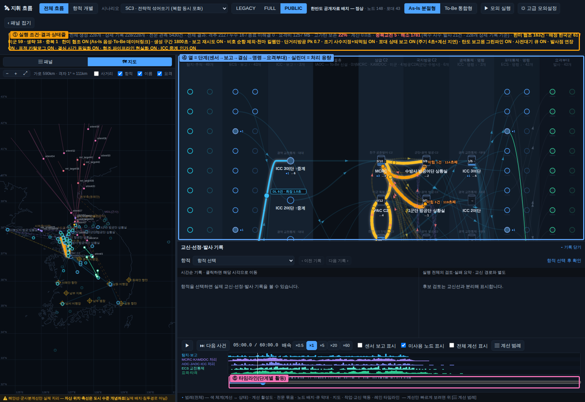
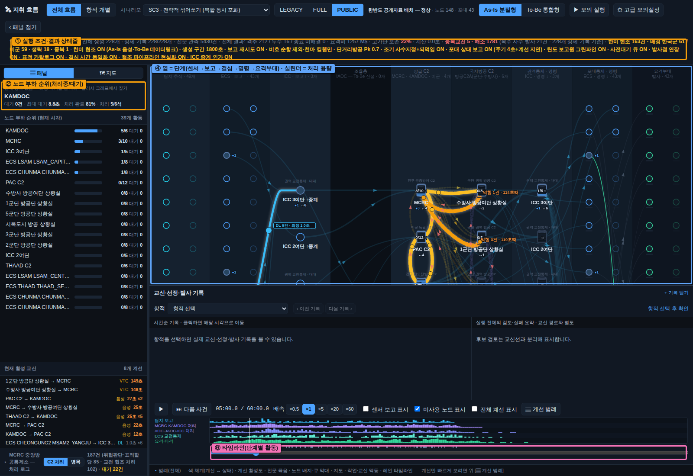

# 공개자료 기반 배치(HANBANDO_PUBLIC) 실험 — FULL 배치와의 비교 (2026-10-03 · 실험 브랜치 `claude/public-deployment-a1mk41`)

> 이 문서의 모든 좌표·수치는 공개자료 기반의 **정책연구용 개념값**이며 실제 작전배치·진지 좌표가 아닙니다. 좌표는 도시·기지 중심 수준입니다.

## 1. 왜 다시 배치했나

FULL 배치(251노드 · 포대 84)는 비호·천마 45개 중대를 휴전선 남쪽 9 km 띠에 등간격으로 생성하고, 서울 시내에는 단거리 포대를 두지 않습니다. 그 결과 수방사 방공 지휘소는 통제할 포대가 없어 책임 지휘소가 되지 못하고, 화면에서는 전문 0건으로 흐리게 남았습니다(사용자 검토 2026-10-03). 또 남부 천궁-II·PAC-3와 후방 비호·천마 다수는 어떤 위협도 요격 가능 구간에 들어오지 않아 강도 5배에서도 0발이었습니다(효과척도 결과서 7장).

이 배치는 **언론·공개자료에 널리 알려진 부대 위치만으로** 도시 수준에서 다시 구성한 것입니다. 포대 수를 84 → 43으로 줄이고, 육군 방공 지휘소를 공개된 편제(수방사 방공여단 · 1·2·3·5군단 방공단 · 해병 서북도서)로 바꾸고, 서울 시내에 수방사 소속 4개 중대를 두었습니다. 군단 번호는 공개된 현행 편제명이며 2030 시점의 개편은 반영하지 않았습니다(등급 C).

## 2. 배치 구성

### 2-1. 지휘소

| 노드 | 위치(도시 수준) | 통제 자산 | 근거 등급 |
|---|---|---|---|
| 탄도탄작전통제소(KAMDOC) · 중앙방공통제소(MCRC) | 오산 | 공군 전체 | public (FULL과 같음) |
| 방공여단 통제소(ICC) 1·2·3여단 | 대구 · 천안 · 서울 금천 | 1여단: 대구·광주·김해 PAC-3 / 2여단: 충주·청주 PAC-3, 청주·원주·대전 천궁-II, 중부 L-SAM / 3여단: 서울공항·수원·수도권 북부 PAC-3, 수도권 천궁-II 5, 수도권 L-SAM | public |
| **수방사 방공여단 상황실** | 서울 관악 | 서울 시내 천마 2·비호 2 중대 · TPS-880K 서울 | public(소재지) · estimated(중대 위치) |
| 1군단 방공단 상황실 | 고양 | 고양·파주·문산·김포 4개 중대 · TPS-880K 강화·파주 | public · estimated |
| 5군단 방공단 상황실 | 포천 | 포천·연천·철원·동두천 4개 중대 · TPS-880K 연천·철원 | public · estimated |
| 2군단 방공단 상황실 | 춘천 | 화천·춘천·양구 3개 중대 · TPS-880K 화천 | public · estimated |
| 3군단 방공단 상황실 | 인제 | 인제·고성·속초 3개 중대 · TPS-880K 서화·고성 | public · estimated |
| 해병 서북도서 방공 상황실 | 백령 | 백령·연평 비호 2개 중대 · TPS-880K 백령·연평 | public |
| THAAD 지휘소 · Patriot 지휘소(미군) | 오산 | THAAD 성주 · Patriot 오산·험프리스·군산·케이시 | public (FULL에서 캠프워커 제외) |

### 2-2. 포대·레이더

| 구분 | FULL | PUBLIC | 비고 |
|---|---|---|---|
| L-SAM | 3 (남부·중북·수도) | 2 (수도·중부) | 2030 가정 · estimated |
| 천궁-II | 22 (전국 공항 권역) | 8 (수도권 벨트 5 · 중부 3) | 옛 호크 벨트 승계 가정 · estimated |
| PAC-3(공군) | 8 | 8 (서울공항·수원·수도권 북부·충주·청주·대구·광주·김해) | 기지 권역 public |
| 비호·천마 중대 | 45 (휴전선 띠 등간격 · 비호 28·천마 17) | 20 (수방사 4 · 1군단 4 · 5군단 4 · 2군단 3 · 3군단 3 · 서북도서 2 · 비호 12·천마 8) | 각 6대 |
| THAAD · 미군 Patriot | 1 · 5 | 1 · 4 | 캠프워커 제외 |
| 그린파인 · FPS-117 · TPS-880K | 4 · 16 · 12 | 4 · 12 · 10 | FPS-117 「본토 12기」 |
| **노드 합계 (As-Is)** | 251 (포대 84) | 148 (포대 43) | |

재생성·확인: `node docs/analysis/2026-10-03-public-deployment/pubexp.mjs HANBANDO_PUBLIC_NORMAL 29,30,31` (이 폴더의 `pubexp-*.json`). 화면: `K-JAMDS_지휘흐름_단일본.html?dep=HANBANDO_PUBLIC_NORMAL` 또는 상단 PUBLIC 버튼.

## 3. 결과 — FULL 대 PUBLIC (SC3 · 강도 1배 · 생성 1800초 · 관측 3600초 · 화면 기본 플래그 · seed 29·30·31)

{{RESULTS}}

## 4. 읽는 법과 한계

- 이 배치는 **좌표·편제 모두 공개된 범위의 도시 수준 개념값**입니다. 실제 진지·중대 수·탄 보유량은 반영하지 않았고, 비호·천마 중대 수(20)는 공개 편제에서 "군단 방공단·수방사 방공여단이 운용한다"는 사실만 옮긴 가정입니다.
- 포대 수가 84 → 43으로 줄었으므로 격추 수 차이는 「배치의 사실성」과 「포대 수 감소」가 겹친 결과입니다. 두 효과를 가르려면 FULL에서 포대만 43개로 줄인 대조군이 필요합니다(미실시).
- 시나리오(SC3)는 바뀌지 않았습니다. 위협 분포가 중부·동부 축선 탄도탄·방사포에 쏠려 있어, 남부 자산을 줄인 영향은 작게 나타납니다.
- 군단 번호·소재지는 2026년 기준 공개 편제이고, 모델의 다른 수치(처리 시간·지연·요격확률)는 FULL과 같습니다.
